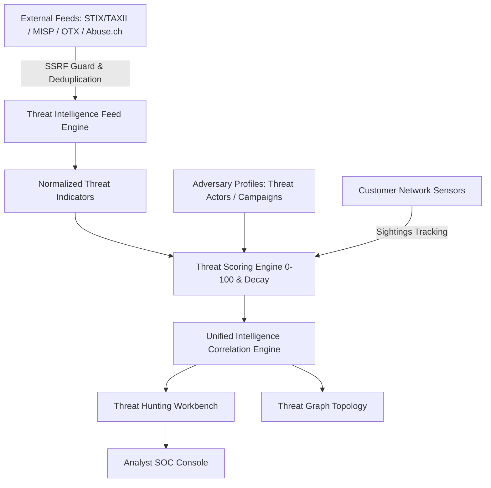

# AEGIVANTA — PHASE 18 PLATFORM ARCHITECTURE

## Enterprise Threat Intelligence & Threat Hunting Platform

### 1. System Overview
Aegivanta Phase 18 upgrades the platform's threat intelligence and hunting architecture into an enterprise-grade adversary profiling, feed federation, transparent scoring, and analyst hunting workbench.

### 2. Core Architecture Modules
- **Threat Actor & Campaign Profiler**: Multi-stage adversary attribution (Nation-State, Cybercriminal, Hacktivist) with MITRE technique alignment.
- **Federated Feed Ingestion**: Extensible provider architecture with SSRF validation preventing internal IP querying.
- **Transparent Threat Scoring (0–100)**: Multi-factor scoring incorporating source reliability, confidence, sightings frequency, severity, and time decay.
- **Analyst Threat Hunting Workbench**: Query builder and reusable hunting templates across IPs, domains, hashes, lateral movement, and ATT&CK techniques.
