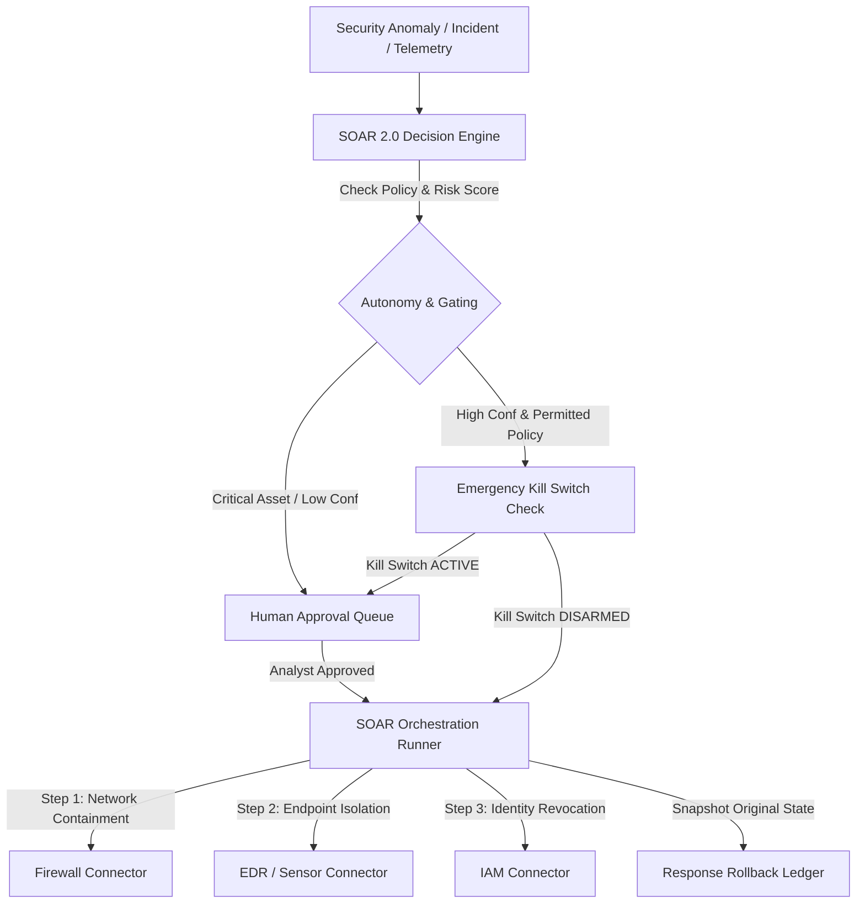

# AEGIVANTA — PHASE 19 PLATFORM ARCHITECTURE

## Autonomous SOC & SOAR 2.0 Layer

### 1. System Topology
Aegivanta Phase 19 introduces an enterprise-grade autonomous SOC orchestration layer coordinating declarative playbooks, human approval gating, emergency containment kill switches, and reversible action rollback.

### 2. Core Pillars
- **Declarative Playbook Engine**: Structured JSON/YAML playbooks with syntax validation, dry-run simulation mode, and step-level execution tracking.
- **Explainable Multi-Factor Decision Engine**: Integrates asset criticality, alert severity, threat intelligence score, and ML confidence.
- **Human-In-The-Loop & Kill Switch**: Fast manual approval queues with a global emergency kill switch.
- **Reversible Containment & Rollback**: Automatic capture of pre-action state snapshots for zero-disruption recovery.
