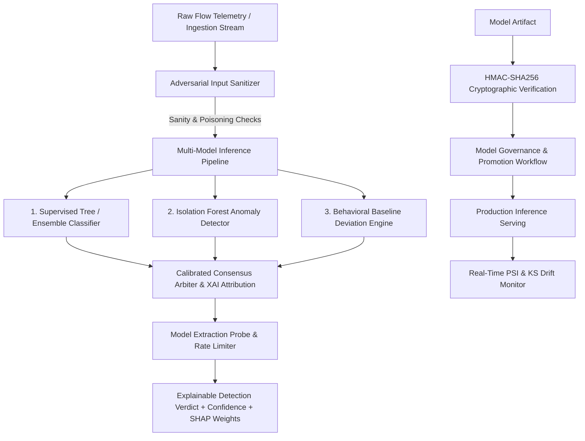

# AEGIVANTA — PHASE 20 AI/ML SECURITY INTELLIGENCE ARCHITECTURE

## 1. System Topology & Layers
Phase 20 integrates enterprise AI security intelligence across multi-model inference, cryptographic governance, statistical drift tracking, adversarial attack mitigation, and Copilot 2.0 reasoning.

## 2. Core Capabilities
- **Multi-Model Orchestration**: Combines Supervised, Isolation Forest Anomaly, Behavioral Deviation, and Calibrated Consensus.
- **Model Security & Integrity**: HMAC-SHA256 signature verification prevents tampering.
- **Continuous Drift Auditing**: Tracks Population Stability Index (PSI) and Kolmogorov-Smirnov stats.
- **Adversarial Hardening**: Multi-layer filters against prompt injections, data poisoning, and model extraction probes.
- **AI Copilot 2.0**: Sanitized contextual analyst reasoning with strict human approval gating.
