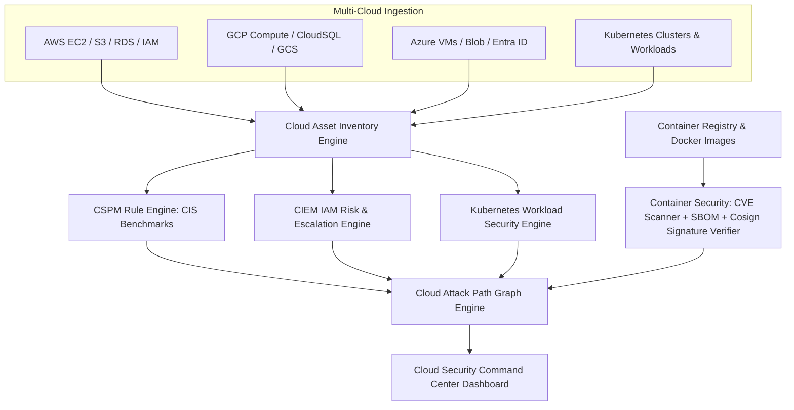

# AEGIVANTA — PHASE 21 CLOUD & CONTAINER SECURITY ARCHITECTURE

## 1. Multi-Cloud & Container Security Fabric
Phase 21 provides unified Cloud Security Posture Management (CSPM), Kubernetes Security Posture Management (KSPM), Cloud Infrastructure Entitlement Management (CIEM), Container Image & SBOM security, and Graph-based Cloud Attack Path modeling.

## 2. Core Capabilities
- **Cloud Asset Inventory**: Discovers and normalizes multi-cloud assets across AWS, GCP, Azure, and Kubernetes.
- **CSPM Misconfiguration Detection**: Real-time auditing against CIS AWS/K8s benchmarks.
- **Container Vulnerability & SBOM Scanner**: CycloneDX SBOM generator, CVE matching with CVSS scoring, and Cosign image signature verification.
- **Kubernetes Workload Security**: Evaluates manifests for `privileged`, `hostNetwork`, dangerous capabilities, and plaintext credentials.
- **CIEM IAM Risk Analyzer**: Detects stale accounts, over-privileged wildcards, and multi-hop privilege escalation vectors.
- **Explainable Attack Path Graphs**: Models kill chains from Internet ingress to S3/DB exfiltration with prescriptive remediation sequences.
