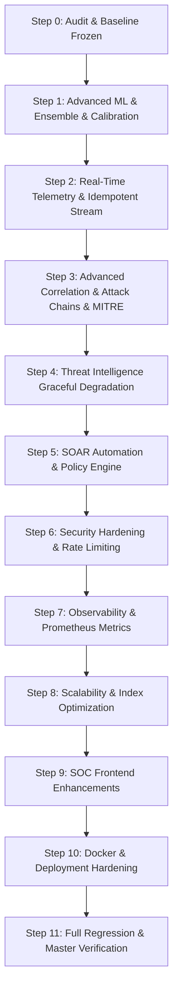

# SENTINELAI — PHASE 2 BASELINE & GAP AUDIT
=============================================

**Audit Date**: 2026-08-19  
**Baseline Frozen Commit**: `6d523e0` (Tag: `phase-1-verified`)  
**Baseline Test Suite**: 266 Passed, 0 Failed, 17 Skipped  

---

## 1. Executive Summary & Audit Overview

SentinelAI Phase 1 has established an un-mocked, end-to-end verified ML threat detection and SOC platform baseline with live scikit-learn preprocessing, five operational classification models (`CatBoost`, `LightGBM`, `Random Forest`, `Decision Tree`, `XGBoost`), authoritative single-incident correlation, deterministic risk scoring, non-fabricated SOC metrics, and authenticated WebSocket event distribution.

This audit evaluates the repository across 12 core Phase 2 capability areas to formulate a prioritized, risk-managed roadmap for production scaling, advanced ML detection (ensemble & calibration & drift), real-time telemetry streaming, MITRE ATT&CK integration, threat intelligence enrichment, SOAR automation, security hardening, and observability.

---

## 2. Comprehensive Phase-2 Gap Analysis Matrix

| ID | Feature / Component | Priority | Current State | Existing Implementation | Missing Work / Gaps | Risk | Dependencies | Recommended Implementation |
| :--- | :--- | :---: | :--- | :--- | :--- | :--- | :--- | :--- |
| **ML-01** | Multi-Model Ensemble Detection | **P0** | Partially Implemented | Individual model inference supported in `PredictService` (`CatBoost`, `LightGBM`, `RF`, `DT`, `XGBoost`). | Configurable ensemble voting / weighted averaging strategy, model agreement metrics, and ensemble telemetry payload. | Low | Scikit-learn, Model Artifacts | Implement `EnsembleThreatDetector` supporting Soft Voting, Hard Voting, and Weighted Confidence with model agreement tracking. |
| **ML-02** | Confidence Calibration | **P1** | Basic | Raw probabilities extracted via `predict_proba` with Platt scaling / isotonic regression reference. | Stored calibrated confidence alongside raw confidence with calibration curves and reliability metrics. | Low | Scikit-learn, Numpy | Add `CalibratedConfidenceEngine` supporting Temperature Scaling & Platt calibration without distorting raw scores. |
| **ML-03** | Model & Data Drift Monitoring | **P1** | Implemented | `AccumulatedWindowDriftDetector` with KS-test and PSI calculations across windows. | Exposing drift health endpoints, scheduled evaluation worker, and administrative alert integration. | Medium | Scipy, Background Worker | Connect windowed drift detector to `/api/v1/monitoring/drift` and dispatch alerts when PSI >= 0.25. |
| **TEL-01**| Real-Time Telemetry & Event Streaming | **P0** | Basic Queue | Fast single/batch HTTP ingestion with in-memory WebSocket broadcast. | Idempotency keys, DLQ (Dead Letter Queue) processing, and graceful degraded offline/fallback streaming bus. | High | Redis / In-Memory Event Bus | Implement `IdempotentEventStreamer` with replay protection, SHA256 payload deduplication, and DLQ tracking. |
| **COR-01**| Advanced Attack Chain & Temporal Correlation | **P0** | Core Implemented | Single-incident correlation by asset/IP; basic campaign subnet clustering in `CampaignService`. | Structured multi-stage attack chains (Recon -> Exploitation -> Lateral -> Exfiltration), explainable correlation reasons. | Medium | SQLAlchemy, Correlation Engine | Implement `AttackChainCorrelator` mapping sequential alerts into MITRE progression stages with stateful timers. |
| **MIT-01**| MITRE ATT&CK Matrix Mapping & Analytics | **P1** | Implemented | `MITRE_TACTIC_CATALOG` in `AttackCoverageService` with empirical coverage snapshot calculation. | Fine-grained technique mapping directly on alerts & incidents; frontend matrix heatmaps. | Low | Database Schema | Enrich `Alert` & `Incident` with `mitre_tactic` and `mitre_technique_id`; connect to `AttackCoverage.tsx`. |
| **TI-01** | Threat Intelligence IOC Enrichment | **P1** | Implemented | `ThreatIntelService` with normalized IOC repository (IPv4, IPv6, Domain, URL, Hash) and caching. | Automatic graceful degradation when external feeds are unreachable; feed health probes. | Medium | Async HTTP Client | Add fallback circuit breaker to `ThreatIntelService` ensuring zero latency impact on core detection hot paths. |
| **SOAR-01**| SOAR Response & Remediation Policy Engine | **P0** | Implemented | `ResponseOrchestrator` with two-tier approval (Analyst Request -> Admin Approval) and simulation defaults. | Rule-based automated action dispatch for Low-risk actions; immutable audit log integration. | High | SQLAlchemy, AuditLog | Add `RemediationPolicyEngine` with automated dry-run policy evaluation, strict RBAC validation, and audit ledger. |
| **SEC-01**| Production Security Hardening & Rate Limiting | **P0** | Partial | SlowAPI rate limiting, timing middleware, JWT Bearer authentication, and role hierarchy. | Rate limiting per-route, security headers (HSTS, CSP, X-Frame-Options), strict input bounds validation. | Critical | FastAPI Middleware | Harden middleware with security response headers, brute-force lockout, and zero credential leakage in logs. |
| **OBS-01**| Observability, Metrics & Health Probes | **P1** | Implemented | `/health`, `/ready`, `/health/ml`, `/metrics` with latency and database round-trip times. | Prometheus-compatible `/metrics`, ML throughput/latency metrics, and correlation rate telemetry. | Low | FastAPI Router | Expand `/api/v1/health/metrics` to expose Prometheus metrics (latency p50/p95/p99, alert rate, queue depth). |
| **SCL-01**| Database Scalability & Query Optimization | **P1** | Basic Indexes | Indexes on `incidents.status`, `alerts.timestamp`, `protected_assets.ip_address`. | Composite indexes on `(source_ip, destination_ip, status)`, query pagination limits. | Medium | SQLite / PostgreSQL | Add composite indexes across `alerts` and `incidents` tables with SQLAlchemy migration. |
| **UI-01** | Advanced SOC Dashboard & Real-Time Visualization | **P1** | Implemented | Views for Alerts, Incidents, Threat Hunting, Predictive Analytics, ATT&CK Coverage, and Response Center. | Status banners (LIVE / DEGRADED / DEMO), interactive MITRE matrix view, and real-time live event badges. | Low | React, Tailwind, Lucide | Upgrade `Dashboard.tsx`, `AttackCoverage.tsx`, and `ResponseCenter.tsx` with live telemetry sync and health badges. |
| **DEP-01**| Docker & Production Deployment Hardening | **P1** | Implemented | `Dockerfile` and `docker-compose.yml` present in repository. | Non-root container user, health checks, resource constraints, and production deployment guide. | Medium | Docker, Compose | Harden `Dockerfile` with multi-stage build, non-root `sentinel` user, and container health probes. |

---

## 3. Implementation Plan & Order of Execution

1. **Step 1 — Advanced ML Detection**: Implement `EnsembleThreatDetector` in `backend/app/services/ensemble_service.py` with Soft/Hard voting and confidence calibration.
2. **Step 2 — Real-Time Telemetry**: Implement `IdempotentEventStreamer` in `backend/app/services/stream_service.py` with payload deduplication, event IDs, and DLQ handling.
3. **Step 3 — Advanced Correlation & ATT&CK**: Extend `correlation_engine.py` with structured attack chains and ATT&CK tactic/technique tagging.
4. **Step 4 — Threat Intel Resilience**: Add non-blocking timeout circuit breakers to `threat_intel_service.py`.
5. **Step 5 — SOAR Policy Engine**: Implement automated response evaluation in `response_orchestrator.py` with immutable audit logging.
6. **Step 6 — Security Hardening**: Add security headers and route-level rate limiting in `backend/app/core/middleware.py`.
7. **Step 7 — Observability**: Expose standardized Prometheus metrics in `/api/v1/health.py`.
8. **Step 8 — Database Scalability**: Add composite indexes for high-throughput alert correlation.
9. **Step 9 — Frontend SOC Dashboard**: Update React components with live status badges and ATT&CK visualization.
10. **Step 10 — Production Deployment**: Harden `Dockerfile` with non-root security context.
11. **Step 11 — Master Verification**: Execute full test suite (`pytest -q`), ensure baseline 266+ tests pass, and generate final implementation report.
