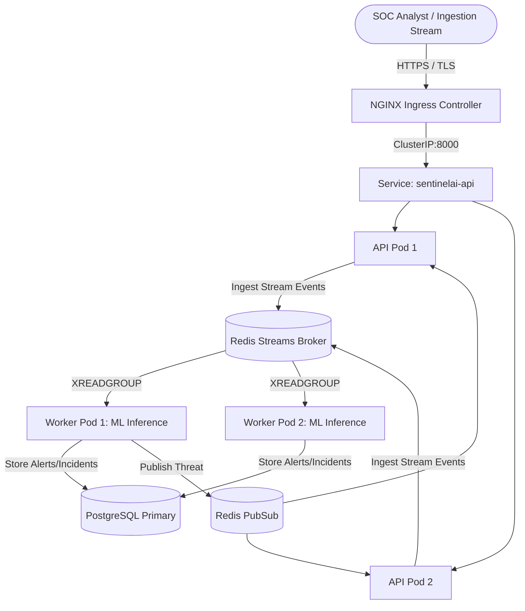

# SENTINELAI — PHASE 3.3 PRODUCTION KUBERNETES DEPLOYMENT GUIDE
================================================================

## 1. Prerequisites & Target Architecture

SentinelAI Kubernetes infrastructure is architected for high-availability, microsegmented SOC operations with independent horizontal autoscaling for ingestion API endpoints and streaming ML workers.



---

## 2. Deployment Procedure

### Step 1: Create Namespace & Security Context
```bash
kubectl apply -f k8s/namespace.yaml
kubectl apply -f k8s/serviceaccount.yaml
```

### Step 2: Inject Secrets & ConfigMap
```bash
# Apply ConfigMap
kubectl apply -f k8s/configmap.yaml

# Generate & apply Secret (replace placeholders with Vault/KMS values)
kubectl apply -f k8s/secret-template.yaml
```

### Step 3: Deploy Redis Streaming Broker & Network Policy
```bash
kubectl apply -f k8s/redis.yaml
kubectl apply -f k8s/networkpolicy.yaml
```

### Step 4: Deploy API, Workers, Autoscalers & Ingress
```bash
kubectl apply -f k8s/deployment-api.yaml
kubectl apply -f k8s/deployment-worker.yaml
kubectl apply -f k8s/service-api.yaml
kubectl apply -f k8s/hpa.yaml
kubectl apply -f k8s/pdb.yaml
kubectl apply -f k8s/ingress.yaml
```

---

## 3. Verification & Health Monitoring

```bash
# Check rollout status
kubectl rollout status deployment/sentinelai-api -n sentinelai
kubectl rollout status deployment/sentinelai-worker -n sentinelai

# Query Prometheus metrics endpoint
kubectl exec -it deployment/sentinelai-api -n sentinelai -- curl -s http://localhost:8000/api/v1/metrics/prometheus
```

---

## 4. Rollback Procedure

If a deployment update fails health probes or causes model regression:
```bash
kubectl rollout undo deployment/sentinelai-api -n sentinelai
kubectl rollout undo deployment/sentinelai-worker -n sentinelai
```
