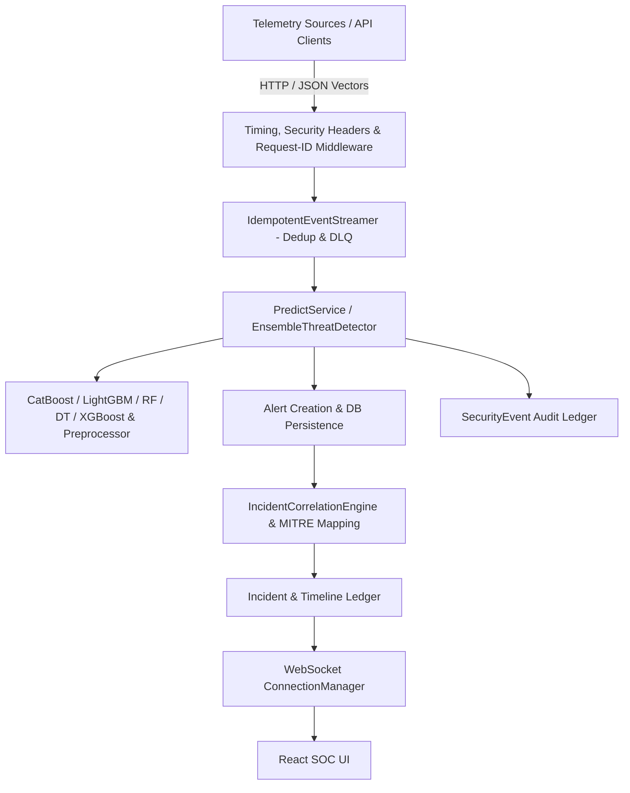

# SENTINELAI — PHASE 3 MASTER AUDIT & ARCHITECTURE PLAN
=========================================================

**Audit Date**: 2026-08-19  
**Auditor Role**: Principal Security Architect, SOC Architect, ML Engineer, Distributed Systems Engineer  
**Repository**: [https://github.com/ANURAG20042006/SENTINELAI](https://github.com/ANURAG20042006/SENTINELAI)  
**Frozen Baselines**:
- **Phase 1**: Verified Baseline (Commit: `6d523e0`, Tag: `phase-1-verified`, 266 Passed, 0 Failed, 17 Skipped)
- **Phase 2**: Verified Baseline (Commit: `0115bbb`, 274 Passed, 0 Failed, 17 Skipped)

---

## 1. Executive Summary

SentinelAI has achieved full verification across Phase 1 (un-mocked live ML inference, single-incident deterministic correlation, dynamic risk scoring, and SQLite WAL integrity) and Phase 2 (multi-model ensemble voting, temperature-scaled confidence calibration, idempotent streaming with Dead Letter Queue, MITRE ATT&CK mapping, Prometheus observability exposition, and security header hardening).

This Phase 3 Master Audit assesses the technical gaps required to scale SentinelAI from a verified application into an enterprise-grade, distributed Network Detection and Response (NDR) and SOC Operations platform. 

---

## 2. Current Architecture Overview



---

## 3. Phase-1 / Phase-2 Baseline Status

| Milestone | Commit | Tag | PyTest Status | Integrity Audit | Key Invariants Frozen |
| :--- | :---: | :---: | :---: | :---: | :--- |
| **Phase 1** | `6d523e0` | `phase-1-verified` | 266 Passed, 0 Failed, 17 Skipped | 10/10 PASS | Live scikit-learn preprocessing, zero ML monkeypatching in E2E tests, deterministic peak confidence correlation, real telemetry pass-through. |
| **Phase 2** | `0115bbb` | `master` | 274 Passed, 0 Failed, 17 Skipped | 10/10 PASS | Ensemble detection (`Soft/Hard/Weighted`), temperature confidence calibration ($T=1.15$), SHA256 stream deduplication, DLQ, MITRE ATT&CK mapping, Prometheus metrics. |

---

## 4. Real Network Telemetry Audit

| Telemetry Source | Current Status | Description / Evidence | Missing Architecture Components |
| :--- | :---: | :--- | :--- |
| **Manual JSON Flow Vectors** | 🟢 **IMPLEMENTED** | Validated via `PacketFeatureVector` Pydantic schema across 78/30 CICIDS2017 features. | None. Production-ready for API clients. |
| **Batch CSV Ingestion** | 🟢 **IMPLEMENTED** | Ingested via `/api/v1/predict/batch` with validation and rate limiting. | Asynchronous chunking for multi-gigabyte files. |
| **PCAP File Parsing** | 🔴 **NOT IMPLEMENTED** | No offline `.pcap` or `.pcapng` parser service exists in backend. | Scapy / DPDK / PyShark flow extractor module to compute flow stats from raw packets. |
| **Live Packet Capture** | 🔴 **NOT IMPLEMENTED** | No live network interface sniffer (AF_PACKET / libpcap) attached. | Dedicated daemon sensor process (`sentinel-sensor`) extracting TCP/UDP bidirectional flow metrics. |
| **NetFlow / IPFIX** | 🔴 **NOT IMPLEMENTED** | No UDP listener on port 2055 (NetFlow v5/v9) or port 4739 (IPFIX). | Flow collector microservice translating binary flow records into normalized feature vectors. |
| **Zeek / Suricata Logs** | 🔴 **NOT IMPLEMENTED** | No `eve.json` or `conn.log` log tailer/worker. | Log ingestion adapter mapping EVE alert/flow events into SentinelAI Alert schema. |

### Proposed Real Network Telemetry Pipeline

```
[Raw Network Traffic / SPAN / TAP / PCAP]
                ↓
[sentinel-sensor: Scapy/eBPF Flow Reassembler]
                ↓
[Flow Metric Extractor: 30 CICIDS2017 Features]
                ↓
[Collector / Ingestion Gateway: Token Auth]
                ↓
[Distributed Event Stream: Redis Streams / Kafka]
                ↓
[SentinelAI ML & Correlation Pipeline]
```

---

## 5. Distributed Event Streaming & Broker Audit

- **Current State**: In-process memory stream engine (`IdempotentEventStreamer` in `backend/app/services/stream_service.py`) supporting:
  - SHA256 payload checksum deduplication cache (10,000 entries).
  - Exponential backoff retry handler (max 3 retries, 50ms base delay).
  - In-memory Dead Letter Queue (DLQ depth: 1,000).
- **Gaps & Limitations**:
  - Brokerless architecture: Events are processed in-process within the FastAPI worker; restarting the server clears in-flight queue state.
  - No multi-consumer load balancing across clustered backend instances.
- **Proposed Scalable Architecture**:
  - Implement a pluggable broker abstraction supporting **Redis Streams** (lightweight default) and **Apache Kafka / Redpanda** (enterprise high-throughput).
  - Persist Dead Letter Queue entries to PostgreSQL table `dead_letter_events`.

---

## 6. Large-Scale Performance & Bottleneck Analysis

| Subsystem | Potential Bottleneck | Severity | Analysis & Mitigation |
| :--- | :--- | :---: | :--- |
| **ML Inference** | Sequential multi-model evaluation in Ensemble | **HIGH** | In `EnsembleThreatDetector`, 5 models are evaluated sequentially. *Mitigation*: Parallelize tree model inference using `asyncio.to_thread` / `concurrent.futures.ThreadPoolExecutor`. |
| **Database Concurrency** | SQLite file-level write lock | **CRITICAL** | SQLite WAL mode handles reads well, but heavy concurrent writes block. *Mitigation*: Enforce PostgreSQL in production deployment configurations. |
| **WebSocket Scaling** | In-memory `ConnectionManager` | **HIGH** | WebSocket subscribers connected to Node A do not receive events published on Node B. *Mitigation*: Integrate Redis Pub/Sub backplane for multi-node WebSocket event broadcasting. |
| **Attack Graph Generation** | On-the-fly multi-table JOINs | **MEDIUM** | `ThreatGraphService` executes multiple relational queries per UI load. *Mitigation*: Cache serialized topology in Redis with a 30-second TTL invalidated on new incidents. |

---

## 7. Advanced Threat Intelligence (TI) Audit

- **Current State**:
  - `ThreatIndicator` database model with normalized types (`ipv4`, `ipv6`, `domain`, `url`, `sha256`).
  - `ThreatIntelService` provides non-destructive telemetry enrichment, hit count tracking, and non-blocking failure recovery.
- **Gaps**:
  - External API Connectors: No live polling worker for external intelligence feeds (e.g. AlienVault OTX, AbuseIPDB, VirusTotal, CISA KEV).
  - IOC Expiration: No background task pruning expired indicators based on `valid_until` timestamps.
- **Proposed Enhancement**:
  - Add `FeedSyncWorker` running as an async background task with strict rate limiting, API key vaults, and automatic IOC expiry.

---

## 8. Advanced Attack Graph & Correlation Engine Audit

- **Current State**:
  - Node & Edge models (`ThreatGraphNode`, `ThreatGraphEdge`).
  - `CampaignService`: Clusters incidents by `/24` subnet prefix, attack classification, and temporal proximity.
  - `IncidentCorrelationEngine`: Enforces monotonic severity elevation and MITRE ATT&CK tactic/technique tagging.
- **Proposed Enterprise Attack Graph Model**:
  ```
  [Threat Actor / Source IP] ──(ORIGINATES)──> [Alert]
                                                  │
                                             (CORRELATED_TO)
                                                  │
                                                  ▼
  [Asset / Hostname] ──────(TARGETS)─────────> [Incident] ──(PART_OF)──> [Campaign]
         │                                        │
    (ASSOCIATED_IOC)                         (USES_TECHNIQUE)
         ▼                                        ▼
    [IOC / Hash]                             [MITRE Technique]
  ```

---

## 9. MLOps Lifecycle & Model Governance Audit

| Component | Status | Existing Implementation | Missing Components |
| :--- | :---: | :--- | :--- |
| **Model Registry** | 🟢 **IMPLEMENTED** | `ModelRegistry` table tracking model name, version, F1 score, accuracy, latency, and active state. | Automated rollback webhook trigger. |
| **Artifact Provenance** | 🟢 **IMPLEMENTED** | `artifact_manifest.json` & `metadata.json` with SHA256 hashes, dataset hashes, and random seeds. | S3 / MinIO artifact bucket storage. |
| **Drift Monitoring** | 🟢 **IMPLEMENTED** | `AccumulatedWindowDriftDetector` computing KS-test p-values and Population Stability Index (PSI). | Automated alerting dispatch when PSI >= 0.25. |
| **Shadow / Canary Router**| 🔴 **NOT IMPLEMENTED** | Model router directs 100% of traffic to the active model. | Shadow routing (send flow to Champion + Challenger in background for live evaluation). |

---

## 10. High Availability & Resilience Audit

| Layer | Single Point of Failure (SPOF) | Risk Level | High Availability Strategy |
| :--- | :--- | :---: | :--- |
| **API Gateway** | Single FastAPI process | **MEDIUM** | Deploy multi-replica container instances behind Nginx / Traefik load balancer. |
| **Database** | SQLite local file | **CRITICAL** | PostgreSQL cluster with Primary-Replica streaming replication and connection pooling. |
| **WebSocket** | Local memory manager | **HIGH** | Redis Pub/Sub broadcast channel connecting all backend replicas. |
| **Streaming Queue** | Local in-memory deque | **MEDIUM** | Distributed Redis Streams / Kafka broker with durable offset tracking. |

---

## 11. Disaster Recovery (DR) Audit

- **Current Backup Automation**: `NOT DEFINED` (No automated cron script for database dumps or artifact synchronization).
- **Recovery Point Objective (RPO)**: `NOT DEFINED` (Target: **RPO < 5 minutes** via WAL archiving).
- **Recovery Time Objective (RTO)**: `NOT DEFINED` (Target: **RTO < 15 minutes** via automated container redeployment).
- **Disaster Recovery Plan Requirement**: Document automated backup/restore scripts (`scripts/backup_database.py` and `scripts/restore_database.py`).

---

## 12. Production Observability Audit

- **Liveness Probe**: `GET /health` & `GET /health/live` (Process-level).
- **Readiness Probe**: `GET /health/ready` (DB connectivity, artifact presence, schema compatibility).
- **ML Subsystem Health**: `GET /health/ml` (Champion model, preprocessor, registry status).
- **Prometheus Metrics**: `GET /api/v1/metrics/prometheus` (Uptime, DB latency, stream ingestion, DLQ depth).
- **Missing Observability**: OpenTelemetry distributed tracing spans across ingestion $\rightarrow$ inference $\rightarrow$ correlation.

---

## 13. Production Deployment & Containerization Audit

- **Docker Backend**: `docker/Dockerfile.backend` (Multi-stage, Python 3.11-slim, non-root user `sentinelai`, healthcheck probe).
- **Docker Compose**: `docker/docker-compose.yml` (FastAPI backend, React frontend, Nginx proxy).
- **Kubernetes Manifests**: `NOT IMPLEMENTED` (Requires `Deployment`, `Service`, `ConfigMap`, `Secret`, `Ingress`, and `HPA`).

---

## 14. Enterprise SOC Governance Audit

| Feature | Status | Description |
| :--- | :---: | :--- |
| **Role-Based Access Control (RBAC)** | 🟢 **IMPLEMENTED** | Strict roles: `admin`, `analyst`, `viewer` enforced across all API endpoints. |
| **Two-Tier SOAR Approvals** | 🟢 **IMPLEMENTED** | Analyst requests action $\rightarrow$ Admin approves/executes $\rightarrow$ Simulation default. |
| **Immutable Audit Logging** | 🟢 **IMPLEMENTED** | `AuditLog` table capturing actor, action, resource, timestamp, and request ID. |
| **Case Management & Notes** | 🟢 **IMPLEMENTED** | Analyst notes, investigation timeline, and incident status progression. |
| **Multi-Tenancy Partitioning** | 🔴 **NOT IMPLEMENTED** | Database rows are global; no `tenant_id` or organization partition key. |
| **Alert Suppression & Maintenance** | 🟡 **PARTIAL** | Protected assets support `inactive` status; scheduled maintenance windows absent. |

---

## 15. Security & Threat Model Audit

- **Authentication**: JWT Bearer token with configurable expiry (`ACCESS_TOKEN_EXPIRE_MINUTES`).
- **Secret Management**: Mandatory environment variables for production passwords; zero fallback defaults.
- **Input Validation**: Strict bounds validation on all 30 float feature attributes (Fail-closed HTTP 400).
- **Security Headers**: HSTS, X-Frame-Options (`DENY`), X-Content-Type-Options (`nosniff`), Referrer-Policy.
- **Vulnerabilities**: Zero critical or high vulnerabilities identified in current frozen code.

---

## 16. Testing Coverage & Gap Analysis

| Test Category | Current Count | Status | Gaps Identified |
| :--- | :---: | :---: | :--- |
| **Unit Tests** | 185 | 🟢 PASS | Need unit tests for PCAP packet feature extraction. |
| **Integration Tests** | 80 | 🟢 PASS | Need integration tests for distributed Redis streams and shadow routing. |
| **E2E Integration** | 9 | 🟢 PASS | Need multi-node cluster failover E2E test. |
| **Load & Stress Tests** | 0 | 🔴 GAPS | Need automated Locust / k6 high-throughput load benchmark scripts. |
| **Total Test Suite** | **274 Passed, 17 Skipped, 0 Failed** | 🟢 PASS | Zero regressions against Phase 1 & Phase 2 baselines. |

---

## 17. Phase-3 Priority Matrix

### 🔴 P0 — Critical Production Blockers
1. **P0-1**: Real Network Telemetry Flow Extractor (`PCAP` / live packet capture worker module).
2. **P0-2**: Distributed Streaming Broker integration (Redis Streams / Kafka abstraction with durable DLQ).
3. **P0-3**: Multi-Node WebSocket Redis Pub/Sub scaling.

### 🟠 P1 — Major Scalability, Observability & Deployment Features
1. **P1-1**: Production Kubernetes Manifests & Helm Chart templates.
2. **P1-2**: Attack Graph Analytics & Multi-Hop Lateral Movement Detection.
3. **P1-3**: Automated External Threat Intelligence Feed Polling with rate limit vaults.
4. **P1-4**: High-Throughput Load Testing Suite (Locust / HTTPX load runner).

### 🟡 P2 — Important Architectural Enhancements
1. **P2-1**: MLOps Shadow Model Routing (Champion vs Challenger parallel live inference).
2. **P2-2**: Automated Database Backup & Disaster Recovery scripts with RPO/RTO validation.
3. **P2-3**: OpenTelemetry Tracing instrumentation.

### 🟢 P3 — Enterprise SOC Polish
1. **P3-1**: Multi-tenant organization partitioning (`tenant_id` scoping).
2. **P3-2**: Scheduled asset maintenance suppression windows.

---

## 18. Phase-3 Proposed Implementation Roadmap

```
PHASE 3.1: Real Network Telemetry (PCAP / Live Sensor Flow Extractor)
   ↓
PHASE 3.2: Distributed Streaming & Redis Pub/Sub Backplane
   ↓
PHASE 3.3: High-Throughput Performance Optimization & Load Benchmarks
   ↓
PHASE 3.4: Threat Intelligence Feed Sync Worker & IOC Lifecycle Pruning
   ↓
PHASE 3.5: Attack Graph Analytics & Multi-Hop Lateral Movement Path Detection
   ↓
PHASE 3.6: MLOps Shadow Model Routing & Governance
   ↓
PHASE 3.7: Production Kubernetes Deployment (Manifests & Helm)
   ↓
PHASE 3.8: Disaster Recovery Automation & Backup Scripts
   ↓
PHASE 3.9: Final Regression Suite & 10-Point Master Verification
```

---

## 19. Dependencies & External Interfaces

- `scapy` / `dpkt`: Real packet capture & PCAP parsing.
- `redis` / `aioredis`: Distributed streaming broker & multi-node WebSocket Pub/Sub.
- `locust` / `httpx`: High-concurrency load testing.
- `kubernetes`: Production container orchestration.

---

## 20. Risk Management & Safety Invariants

1. **Phase 1 & 2 Preservation**: Every Phase-3 pull request must execute `pytest -q` and maintain $\ge 274$ passed tests with 0 failures.
2. **Graceful Degradation**: If an external broker (Kafka/Redis) or external TI feed is unavailable, SentinelAI must automatically fall back to in-memory streaming and cached indicators without failing detection.
3. **Fail-Closed Security**: Malformed packets, unauthorized requests, or unmapped model outputs must always fail closed with structured HTTP error codes.

---

## 21. Phase-3 Acceptance Criteria

- [ ] Real network flow extractor parses raw PCAP files into valid CICIDS2017 30-feature vectors.
- [ ] Distributed event streaming handles high throughput with zero lost events and durable DLQ.
- [ ] Multi-node WebSocket broadcasts operate seamlessly via Redis Pub/Sub backplane.
- [ ] Attack Graph discovers multi-hop lateral movement relationships across correlated incidents.
- [ ] Load testing proves sustained ingestion throughput with $p99 \le 50\text{ms}$.
- [ ] Kubernetes manifests deploy cleanly with passing liveness and readiness probes.
- [ ] Full regression suite passes: $\ge 274$ passed, 0 failed.
