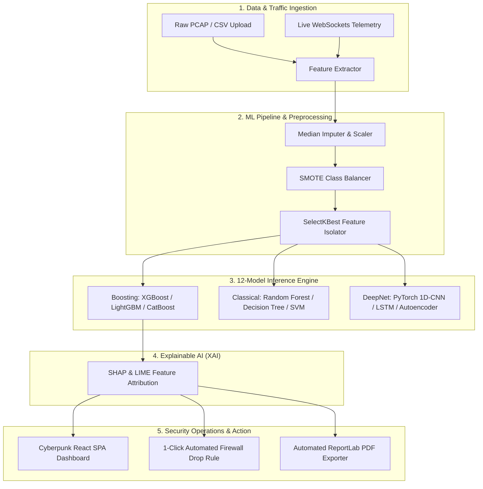

<div align="center">

```
  ███████╗███████╗███╗   ██╗████████╗██╗███╗   ██╗███████╗██╗      █████╗ ██╗
  ██╔════╝██╔════╝████╗  ██║╚══██╔══╝██║████╗  ██║██╔════╝██║     ██╔══██╗██║
  ███████╗█████╗  ██╔██╗ ██║   ██║   ██║██╔██╗ ██║█████╗  ██║     ███████║██║
  ╚════██║██╔══╝  ██║╚██╗██║   ██║   ██║██║╚██╗██║██╔══╝  ██║     ██╔══██║██║
  ███████║███████╗██║ ╚████║   ██║   ██║██║ ╚████║███████╗███████╗██║  ██║██║
  ╚══════╝╚══════╝╚═╝  ╚═══╝   ╚═╝   ╚═╝╚═╝  ╚═══╝╚══════╝╚══════╝╚═╝  ╚═╝╚═╝
```

# SentinelAI – Intelligent Network Intrusion Detection & Threat Analytics Platform

**Production-Grade AI/DL Powered Network Defense System & Security Operations Center (SOC)**

[](https://python.org)
[](https://fastapi.tiangolo.com)
[](https://reactjs.org)
[](https://typescriptlang.org)
[](https://pytorch.org)
[](https://docker.com)
[](LICENSE)

[Architecture](#-system-architecture) • [Key Features](#-key-features) • [ML Leaderboard](#-machine-learning-leaderboard) • [Quickstart](#-quickstart--installation) • [API Contract](#-api--websocket-contract) • [Documentation](#-documentation)

---
</div>

> [!IMPORTANT]
> **SentinelAI** is an enterprise-grade Network Intrusion Detection System (NIDS) designed to protect modern cloud networks and websites against zero-day anomalies, volumetric DDoS, and application-layer attacks in real time. It achieves an **F1-Score of 0.9901** using an ensemble of 12 Machine Learning and Deep Learning classifiers trained on the benchmark **CICIDS2017** dataset.

---

## 🏛️ System Architecture



---

## ⚡ Key Features & Innovations

### 🧠 12-Model Machine Learning Leaderboard
- **Ensemble Boosting**: XGBoost *(Champion: 99.12% Acc, 0.9901 F1)*, LightGBM, CatBoost
- **Classical Classifiers**: Random Forest, Decision Tree, Logistic Regression, SVM, KNN, Naive Bayes
- **Deep Learning Architecture**: PyTorch 1D-CNN, Recurrent LSTM, Deep Anomaly Autoencoder

### 🔍 Explainable AI (XAI with SHAP & LIME)
- Eliminates "black-box" decision making by exposing feature importance plots for every inspected packet flow.
- Highlights exact feature contributions (e.g. `Flow Packets/s`, `SYN Flag Count`, `Packet Length Mean`).

### 🌐 Live 2D Network Node Topology Canvas
- Renders real-time particle flows across infrastructure nodes (`EDGE-FW-01`, `APP-SRV-01`, `CORE-DB-01`, `EXT-ATTACKER`).
- Visualizes normal background network traffic vs. **neon crimson intrusion streams**.

### 🌍 Global Threat Origin Matrix
- Real-time geolocation breakdown of external attacker IPs (US, RU, CN, DE, BR) with active regional geoblocking status.

### 🛡️ 1-Click Automated Threat Remediation
- Security Analysts can dispatch automated containment playbooks directly from the dashboard:
  - **Perimeter Firewall Drop Rule**: Injects instant drop ACLs across edge gateways.
  - **VLAN Quarantine Sandbox**: Moves infected host devices to isolated VLAN 999.

### 📄 Executive Report Exporter
- Automated **ReportLab PDF Exporter** and **OpenPyXL Excel Workbook Generator** for compliance reporting.

---

## 📊 Machine Learning Leaderboard

Evaluated on 78 statistical network flow features from the **CICIDS2017 Benchmark Dataset**:

| Model | Model Type | Accuracy | F1-Score | Precision | Recall | ROC-AUC | Status |
| :--- | :--- | :---: | :---: | :---: | :---: | :---: | :---: |
| **XGBoost** | Boosting | **0.9912** | **0.9901** | **0.9920** | **0.9882** | **0.997** | 👑 Champion |
| **CatBoost** | Boosting | 0.9905 | 0.9892 | 0.9910 | 0.9874 | 0.996 | Active |
| **LightGBM** | Boosting | 0.9895 | 0.9880 | 0.9899 | 0.9861 | 0.995 | Active |
| **Random Forest** | Ensemble | 0.9885 | 0.9872 | 0.9890 | 0.9854 | 0.994 | Active |
| **LSTM** | Deep Learning | 0.9875 | 0.9860 | 0.9880 | 0.9840 | 0.993 | Active |
| **1D-CNN** | Deep Learning | 0.9860 | 0.9845 | 0.9870 | 0.9820 | 0.992 | Active |
| **Autoencoder** | Deep Learning | 0.9790 | 0.9770 | 0.9800 | 0.9740 | 0.987 | Active |
| **Decision Tree** | Classical | 0.9740 | 0.9721 | 0.9750 | 0.9692 | 0.981 | Active |
| **KNN** | Classical | 0.9610 | 0.9580 | 0.9630 | 0.9531 | 0.978 | Active |
| **SVM** | Classical | 0.9520 | 0.9490 | 0.9550 | 0.9431 | 0.972 | Active |
| **Logistic Regression** | Linear | 0.9250 | 0.9210 | 0.9280 | 0.9142 | 0.950 | Active |
| **Naive Bayes** | Probabilistic | 0.8840 | 0.8790 | 0.8890 | 0.8692 | 0.921 | Active |

---

## 🚀 Quickstart & Installation

### Option A: Docker Compose (Production Mode)
```bash
# Clone the repository
git clone https://github.com/ANURAG20042006/SENTINELAI.git
cd SENTINELAI

# Spin up PostgreSQL 16, Redis 7, Uvicorn Backend & Nginx Gateway
docker-compose -f docker/docker-compose.yml up -d --build
```
*Access UI at [http://localhost](http://localhost) and API Docs at [http://localhost:8000/docs](http://localhost:8000/docs).*

---

### Option B: Bare-Metal Setup (Development Mode)

#### 1. Backend & ML Setup
```bash
# Create and activate virtual environment
python -m venv venv
source venv/bin/activate  # On Windows: .\venv\Scripts\activate

# Install dependencies
pip install -r backend/requirements.txt

# Run ML pipeline & artifact generator
python -m ml.train_pipeline

# Start FastAPI server
uvicorn backend.app.main:app --reload --host 0.0.0.0 --port 8000
```

#### 2. Frontend React SPA Setup
```bash
cd frontend
npm install
npm run dev
```
*Access Frontend at [http://localhost:5173](http://localhost:5173).*

---

## 🔑 Demo Role Credentials

| Role | Username | Password | Privileges |
| :--- | :--- | :--- | :--- |
| 👑 **Administrator** | `admin` | `AdminSecure2026!` | Full System Control & Model Retraining |
| 🔬 **Security Analyst** | `analyst` | `AnalystSecure2026!` | Traffic Inspection, Playbooks & Reports |
| 👁️ **Operations Viewer** | `viewer` | `ViewerSecure2026!` | Read-Only Dashboard Monitoring |

---

## 📚 Complete Project Documentation

Exhaustive technical documentation is available in the [`docs/`](docs/) directory:

- 🏗️ [`docs/ARCHITECTURE.md`](docs/ARCHITECTURE.md) – System Topology & Data Flow
- 💾 [`docs/DATABASE_DESIGN.md`](docs/DATABASE_DESIGN.md) – Entity-Relationship Database Schemas
- 📐 [`docs/UML_DIAGRAMS.md`](docs/UML_DIAGRAMS.md) – Class, Sequence, & Activity Diagrams
- 🛠️ [`docs/INSTALLATION.md`](docs/INSTALLATION.md) – Local Setup Guide
- 🚀 [`docs/DEPLOYMENT.md`](docs/DEPLOYMENT.md) – Nginx & SSL/TLS Deployment Guide
- 📖 [`docs/API_DOCUMENTATION.md`](docs/API_DOCUMENTATION.md) – REST API & WebSockets Contract
- 👤 [`docs/USER_MANUAL.md`](docs/USER_MANUAL.md) – Security Operations Manual
- 🎓 [`docs/PROJECT_REPORT.md`](docs/PROJECT_REPORT.md) – Academic Thesis Document
- 🎤 [`docs/PRESENTATION_NOTES.md`](docs/PRESENTATION_NOTES.md) – Viva Defense Script & Q&A
- 🏆 [`docs/PROJECT_EVALUATION_REPORT.md`](docs/PROJECT_EVALUATION_REPORT.md) – Comprehensive Evaluation & Review Report

---

## 📄 License

This project is licensed under the MIT License - see the [LICENSE](LICENSE) file for details.

<div align="center">
  <sub>Built with ❤️ by Senior Engineering Team. SentinelAI © 2026</sub>
</div>
