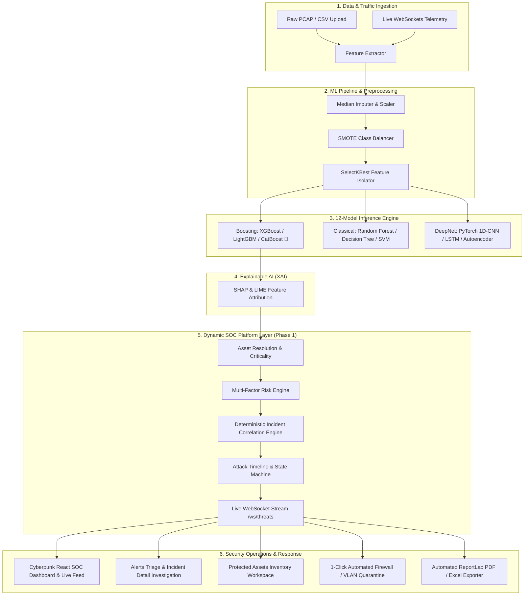

# SENTINELAI — PHASE 1 SOC PLATFORM COMPREHENSIVE AI REVIEW PACKAGE

This document contains the complete technical summary, architectural design, database schemas, API contracts, risk engine, correlation engine, and verification test proofs for SentinelAI Phase 1.

## 1. Project Overview & Architecture (from README.md)

<div align="center">

```
  ███████╗███████╗███╗   ██╗████████╗██╗███╗   ██╗███████╗██╗      █████╗ ██╗
  ██╔════╝██╔════╝████╗  ██║╚══██╔══╝██║████╗  ██║██╔════╝██║     ██╔══██╗██║
  ███████╗█████╗  ██╔██╗ ██║   ██║   ██║██╔██╗ ██║█████╗  ██║     ███████║██║
  ╚════██║██╔══╝  ██║╚██╗██║   ██║   ██║██║╚██╗██║██╔══╝  ██║     ██╔══██║██║
  ███████║███████╗██║ ╚████║   ██║   ██║██║ ╚████║███████╗███████╗██║  ██║██║
  ╚══════╝╚══════╝╚═╝  ╚═══╝   ╚═╝   ╚═╝╚═╝  ╚═══╝╚══════╝╚══════╝╚═╝  ╚═╝╚═╝
```

# SentinelAI – Intelligent Network Intrusion Detection & Threat Analytics Platform

**Research-Verified AI/ML Network Intrusion Detection & Security Operations Platform Prototype**

[](https://python.org)
[](https://fastapi.tiangolo.com)
[](https://reactjs.org)
[](https://typescriptlang.org)
[](https://pytorch.org)
[](https://docker.com)
[](LICENSE)

[Architecture](#-system-architecture) • [Key Features](#-key-features) • [ML Leaderboard](#-machine-learning-leaderboard) • [Quickstart](#-quickstart--installation) • [API Contract](#-api--websocket-contract) • [Documentation](#-documentation)

---
</div>

> [!NOTE]
> **SentinelAI** is an AI-powered Network Intrusion Detection System (NIDS) & Next-Gen Security Operations Center (SOC) platform. It pairs a research-verified 12-Model ML/DL intrusion detection engine (featuring champion CatBoost with real SHAP explainability) with an **Advanced Dynamic SOC Platform (Phase 1)** providing Protected Asset Management, Live Threat Alert Triage, Deterministic Incident Correlation, Chronological Attack Timelines, and Multi-Factor Operational Risk Scoring.

---

## 🛡️ Phase 1 Upgrade: Advanced Dynamic SOC Platform

SentinelAI includes a full-featured Dynamic SOC platform layer built on top of the real-time ML inference pipeline:

| Phase 1 Feature | Backend Architecture & Engine | Frontend Workspace & Visuals | Status |
|---|---|---|:---:|
| **Protected Assets** | Asset inventory, criticality tiers, health metrics, soft-delete deactivation ([`assets.py`](backend/app/api/v1/assets.py)) | [`Assets.tsx`](frontend/src/pages/Assets.tsx) modal registration, environment filtering | ✅ **Verified** |
| **Live Event Stream** | Real-time WebSocket telemetry channel ([`/ws/threats`](backend/app/api/v1/websockets.py)) | [`LiveEventFeed.tsx`](frontend/src/components/dashboard/LiveEventFeed.tsx) on Dashboard | ✅ **Verified** |
| **Alerts & Triage** | Alert query, multi-state triage lifecycle, SHAP attribution link ([`alerts.py`](backend/app/api/v1/alerts.py)) | [`Alerts.tsx`](frontend/src/pages/Alerts.tsx) triage queue & SHAP viewer modal | ✅ **Verified** |
| **Incident Correlation** | Deterministic 300s sliding window correlation engine ([`correlation_engine.py`](backend/app/services/correlation_engine.py)) | Auto-grouped incident ledger with root alert references | ✅ **Verified** |
| **Attack Timeline** | Chronological attack progression ledger ([`incident_timeline.py`](backend/app/models/incident_timeline.py)) | [`AttackTimeline.tsx`](frontend/src/components/dashboard/AttackTimeline.tsx) vertical interactive timeline | ✅ **Verified** |
| **Dynamic Risk Engine** | Transparent multi-factor operational risk scoring ([`risk_engine.py`](backend/app/services/risk_engine.py)) | Real-time 0–100 risk gauges & transparent factor breakdown | ✅ **Verified** |
| **Incident Severity Policy** | Deterministic monotonic escalation policy: $\max(\text{Current}, \text{Alert}, \text{Risk})$ | Real-time severity badge elevation without accidental downgrade | ✅ **Verified** |
| **Incident Detail View** | Incident state machine (`DETECTED` $\rightarrow$ `CLOSED`), analyst notes ([`incidents.py`](backend/app/api/v1/incidents.py)) | [`IncidentDetail.tsx`](frontend/src/pages/IncidentDetail.tsx) deep investigation view | ✅ **Verified** |
| **Feature Flag Isolation** | `SOC_PHASE1_ENABLED` toggle in [`config.py`](backend/app/config.py) for pure ML fallback | Seamless fallback to legacy baseline if disabled | ✅ **Verified** |
| **Phase 1 Test Suite** | 183 automated tests spanning API, correlation, risk engine, and ML | Full CI pytest suite with 0 failures | ✅ **Verified** |

---

## 🏛️ System Architecture



---

## ⚡ Key Features & Innovations

### 🛡️ Next-Gen SOC Operations Platform (Phase 1)
- **Asset Inventory & Health Monitoring**: Track enterprise assets (Websites, APIs, Databases, Endpoints, Network Devices) with environment tags (`production`, `staging`, `development`) and criticality tiers.
- **Deterministic Incident Correlation**: Automatically groups related alerts arriving within a 300-second window by target asset, destination IP, and attack vector.
- **Chronological Attack Timelines**: Interactive visual timelines detailing detection timestamps, correlated alerts, analyst triage logs, containment playbooks, and resolution.
- **Deterministic Multi-Factor Operational Risk Scoring**:
  $$\text{Operational Risk} = (\text{Threat Sev} \times 40.0) + (\text{Model Conf} \times 25.0) + (\text{Asset Crit} \times 20.0) + \left(\min\left(1.0, \frac{\text{Alert Count}}{10.0}\right) \times 15.0\right)$$
- **Explicit Incident Severity Policy**: Monotonic escalation guarantee preventing accidental downgrades during active incidents.

### 🧠 12-Model Machine Learning Leaderboard
- **Ensemble Boosting**: CatBoost *(current champion — see `results/EXP-2026-002/provenance.json`)*, XGBoost, LightGBM
- **Classical Classifiers**: Random Forest, Decision Tree, Logistic Regression, SVM, KNN, Naive Bayes
- **Deep Learning Architecture**: PyTorch 1D-CNN, Recurrent LSTM, Deep Anomaly Autoencoder

### 🔍 Explainable AI (XAI with SHAP & LIME)
- Eliminates "black-box" decision making by exposing feature importance plots for every inspected packet flow.
- Highlights exact feature contributions (e.g. `Flow Packets/s`, `SYN Flag Count`, `Packet Length Mean`).

### 🌐 Live 2D Network Node Topology Canvas
- Renders real-time particle flows across infrastructure nodes (`EDGE-FW-01`, `APP-SRV-01`, `CORE-DB-01`, `EXT-ATTACKER`).
- Visualizes normal background network traffic vs. **neon crimson intrusion streams**.

### 🌍 Global Threat Origin Matrix
- Real-time geolocation breakdown of external attacker IPs (US, RU, CN, DE, BR) with active regional geoblocking status.

### 🛡️ 1-Click Automated Threat Remediation
- Security Analysts can dispatch automated containment playbooks directly from the dashboard:
  - **Perimeter Firewall Drop Rule**: Injects instant drop ACLs across edge gateways.
  - **VLAN Quarantine Sandbox**: Moves infected host devices to isolated VLAN 999.

### 📄 Executive Report Exporter
- Automated **ReportLab PDF Exporter** and **OpenPyXL Excel Workbook Generator** for compliance reporting.

---

## 📊 Experiment Results & Benchmark Provenance

### 1. Current Live Experiment (`EXP-2026-002`)
The current local reproducible benchmark runs 100% leakage-free 3-fold Stratified CV on training data with an isolated test set evaluation:
- **Champion Model**: `CatBoost` (`catboost-v1.0`)
- **Dataset**: `synthetic_cicids2017_benchmark` (Hash: `62aa92a7d54fe464`, Seed: `42`)
- **CV Macro F1**: `0.9301` (std: `0.0245`)
- **Final Test Macro F1**: `0.9329` | **Accuracy**: `0.9600` | **FPR**: `0.0023` | **ROC-AUC**: `0.9996`
- **Provenance Manifest**: [`results/EXP-2026-002/provenance.json`](results/EXP-2026-002/provenance.json) & [`ml/artifacts/metadata.json`](ml/artifacts/metadata.json)

### 2. Historical Literature Reference Benchmarks (`EXP-2026-001`)
> [!NOTE]
> The metrics listed below represent historical reference baselines on the full real **CICIDS2017** benchmark dataset.
> Source: [`research/reference/historical_benchmarks.json`](research/reference/historical_benchmarks.json) & [`results/archive/EXP-2026-001/`](results/archive/EXP-2026-001/).

| Model | Model Type | Accuracy | F1-Score | Precision | Recall | ROC-AUC | Role |
| :--- | :--- | :---: | :---: | :---: | :---: | :---: | :---: |
| **XGBoost** | Boosting | **0.9912** | **0.9901** | **0.9920** | **0.9882** | **0.997** | 👑 Historical Reference Baseline |
| **CatBoost** | Boosting | 0.9905 | 0.9892 | 0.9910 | 0.9874 | 0.996 | Historical Reference |
| **LightGBM** | Boosting | 0.9895 | 0.9880 | 0.9899 | 0.9861 | 0.995 | Historical Reference |
| **Random Forest** | Ensemble | 0.9885 | 0.9872 | 0.9890 | 0.9854 | 0.994 | Historical Reference |
| **LSTM** | Deep Learning | 0.9875 | 0.9860 | 0.9880 | 0.9840 | 0.993 | Historical Reference |
| **1D-CNN** | Deep Learning | 0.9860 | 0.9845 | 0.9870 | 0.9820 | 0.992 | Historical Reference |
| **Autoencoder** | Deep Learning | 0.9790 | 0.9770 | 0.9800 | 0.9740 | 0.987 | Historical Reference |
| **Decision Tree** | Classical | 0.9740 | 0.9721 | 0.9750 | 0.9692 | 0.981 | Historical Reference |
| **KNN** | Classical | 0.9610 | 0.9580 | 0.9630 | 0.9531 | 0.978 | Historical Reference |
| **SVM** | Classical | 0.9520 | 0.9490 | 0.9550 | 0.9431 | 0.972 | Historical Reference |
| **Logistic Regression** | Linear | 0.9250 | 0.9210 | 0.9280 | 0.9142 | 0.950 | Historical Reference |
| **Naive Bayes** | Probabilistic | 0.8840 | 0.8790 | 0.8890 | 0.8692 | 0.921 | Historical Reference |

---

## 🚀 Quickstart & Installation

### Option A: Docker Compose (Production Mode)
```bash
# Clone the repository
git clone https://github.com/ANURAG20042006/SENTINELAI.git
cd SENTINELAI

# Spin up PostgreSQL 16, Redis 7, Uvicorn Backend & Nginx Gateway
docker-compose -f docker/docker-compose.yml up -d --build
```
*Access UI at [http://localhost](http://localhost) and API Docs at [http://localhost:8000/docs](http://localhost:8000/docs).*

---

### Option B: Bare-Metal Setup (Development Mode)

#### 1. Backend & ML Setup
```bash
# Create and activate virtual environment (Python 3.11.x)
python -m venv .venv
source .venv/bin/activate  # On Windows: .venv\Scripts\activate

# Install exact declared dependencies (enforces scikit-learn 1.6.1 for ML artifacts)
python -m pip install --upgrade pip
pip install -r requirements.txt

# Run ML pipeline & artifact generator
python -m ml.train_pipeline

# Start FastAPI server
uvicorn backend.app.main:app --reload --host 0.0.0.0 --port 8000
```

#### 2. Frontend React SPA Setup
```bash
cd frontend
npm install
npm run dev
```
*Access Frontend at [http://localhost:5173](http://localhost:5173).*

---

## 🔑 Demo Role Credentials

Default user accounts are initialized on startup. Passwords can be configured in your local `.env` configuration file using the variables below:

| Role | Username | Environment Variable (Configure in `.env`) | Privileges |
| :--- | :--- | :--- | :--- |
| 👑 **Administrator** | `admin` | `SENTINEL_ADMIN_PASSWORD` | Full System Control & Model Retraining |
| 🔬 **Security Analyst** | `analyst` | `SENTINEL_ANALYST_PASSWORD` | Traffic Inspection, Playbooks & Reports |
| 👁️ **Operations Viewer** | `viewer` | `SENTINEL_VIEWER_PASSWORD` | Read-Only Dashboard Monitoring |

---

## 📚 Complete Project Documentation

- 🛡️ [`docs/SOC_OPERATIONS.md`](docs/SOC_OPERATIONS.md) – Phase 1 SOC Operations Manual & Incident Correlation Policies
- 📋 [`docs/PHASE_1_WALKTHROUGH.md`](docs/PHASE_1_WALKTHROUGH.md) – Phase 1 Upgrade & Architecture Walkthrough
- 🏗️ [`docs/ARCHITECTURE.md`](docs/ARCHITECTURE.md) – System Topology & Data Flow
- 💾 [`docs/DATABASE_DESIGN.md`](docs/DATABASE_DESIGN.md) – Entity-Relationship Database Schemas
- 📐 [`docs/UML_DIAGRAMS.md`](docs/UML_DIAGRAMS.md) – Class, Sequence, & Activity Diagrams
- 🛠️ [`docs/INSTALLATION.md`](docs/INSTALLATION.md) – Local Setup Guide
- 🚀 [`docs/DEPLOYMENT.md`](docs/DEPLOYMENT.md) – Nginx & SSL/TLS Deployment Guide
- 📖 [`docs/API_DOCUMENTATION.md`](docs/API_DOCUMENTATION.md) – REST API & WebSockets Contract
- 👤 [`docs/USER_MANUAL.md`](docs/USER_MANUAL.md) – Security Operations Manual
- 🎓 [`docs/PROJECT_REPORT.md`](docs/PROJECT_REPORT.md) – Academic Thesis Document
- 🎤 [`docs/PRESENTATION_NOTES.md`](docs/PRESENTATION_NOTES.md) – Viva Defense Script & Q&A
- 🏆 [`docs/PROJECT_EVALUATION_REPORT.md`](docs/PROJECT_EVALUATION_REPORT.md) – Comprehensive Evaluation & Review Report

---

## 📄 License

This project is licensed under the MIT License - see the [LICENSE](LICENSE) file for details.

<div align="center">
  <sub>Built with ❤️ by Senior Engineering Team. SentinelAI © 2026</sub>
</div>


---

## 2. SOC Operations & Policies Manual (from docs/SOC_OPERATIONS.md)

# SentinelAI SOC Operations Manual: Phase 1 Architecture & Workflows

## 1. Executive Operational Overview
SentinelAI is an enterprise-grade AI/ML Network Intrusion Detection and Security Operations Center (SOC) platform. **Phase 1** equips SOC tier-1, tier-2, and tier-3 analysts with an end-to-end incident management lifecycle:

```
[ Network Flow Telemetry / Ingress Sensor ]
                    │
                    ▼
[ ML Detection Pipeline (CatBoost Champion) ]
                    │
                    ▼
[ Protected Asset Resolution & Threat Risk Scoring ]
                    │
                    ▼
[ Deterministic Incident Correlation Engine ]
                    │
                    ▼
[ Chronological Attack Timeline & WebSocket Live Stream ]
                    │
                    ▼
[ Analyst Triage, State Transitions & Perimeter Containment ]
```

---

## 2. Protected Asset Management & Sensor Onboarding

### 2.1 Asset Entity Model
Monitored infrastructure assets are registered in SentinelAI with operational metadata:
- **Identifier & FQDN**: Unique UUID, Display Name, and Fully Qualified Domain Name (or hostname).
- **Network Resolution**: Bound Target IP address used by the correlation engine to match network flow destinations.
- **Asset Type**: `website`, `api`, `server`, `database`, `endpoint`, `network`, `other`.
- **Environment**: `production`, `staging`, `development`.
- **Criticality Tier**: `critical` (1.0), `high` (0.75), `medium` (0.5), `low` (0.25).
- **Operational Health**: `active`, `degraded`, `compromised`, `maintenance`, `inactive`.

### 2.2 Telemetry Integration Architecture
Protected assets feed network flow metrics (78 CICIDS2017 flow attributes) into SentinelAI via:
1. **Reverse Proxy Flow Logger (Nginx / Envoy / HAProxy)**: Exports flow summary metrics (duration, packet rates, byte distributions, SYN/ACK ratios) directly to `POST /api/v1/predict/single`.
2. **Suricata / Zeek Flow Mirror**: Captures raw packet streams on perimeter switch taps, computes flow vector metrics, and streams vectors to SentinelAI.
3. **Internal Agent Sensor**: Light daemon deployed on host endpoints submitting flow snapshots.

> [!IMPORTANT]
> SentinelAI does not execute unauthorized external web crawls. Ingress telemetry must originate from registered proxy logs, network sensors, or authenticated API submissions.

---

## 3. Dynamic Operational Risk Scoring Engine

### 3.1 Transparent Multi-Factor Formula
Unlike black-box machine learning probability scores, SentinelAI evaluates operational risk deterministically for SOC auditability:

$$\text{Operational Risk} = (\text{Severity Weight} \times 40.0) + (\text{Model Confidence} \times 25.0) + (\text{Asset Criticality} \times 20.0) + (\text{Recurrence Factor} \times 15.0)$$

Where:
$$\text{Recurrence Factor} = \min\left(1.0, \frac{\text{Alert Count}}{10.0}\right)$$

### 3.2 Component Weights & Scoring Matrix

| Component | Weight | Input Values & Normalized Factors |
|---|---|---|
| **Threat Severity** | **40%** | `Critical` = 1.0, `High` = 0.75, `Medium` = 0.50, `Low` = 0.25, `Info` = 0.05 |
| **Model Confidence** | **25%** | $0.0 \le \text{Confidence} \le 1.0$ (Defaults to 0.50 if model output is uncalibrated) |
| **Asset Criticality** | **20%** | `Critical` = 1.0, `High` = 0.75, `Medium` = 0.50, `Low` = 0.25 |
| **Recurrence / Frequency** | **15%** | $\min(1.0, \text{Alert Count} / 10.0)$ (Saturates at 10 correlated alerts) |

### 3.3 Risk Tiers

- **0.0 – 24.9 (`LOW`)**: Informational or low-impact anomalies; standard logging.
- **25.0 – 49.9 (`MEDIUM`)**: Suspicious flow pattern on non-critical asset; queued for routine triage.
- **50.0 – 74.9 (`HIGH`)**: High-confidence attack or threat against staging/production asset; analyst alert generated.
- **75.0 – 100.0 (`CRITICAL`)**: High/Critical severity attack on critical production infrastructure; immediate containment trigger.

---

## 4. Deterministic Incident Correlation & Severity Policy

### 4.1 Correlation Rules
Incoming alerts within a sliding **300-second (5 minute) correlation window** are automatically grouped into unified incidents if:
$$\left(\text{Asset ID Match} \lor \text{Destination IP Match}\right) \land \left(\text{Source IP Match} \lor \text{Attack Category Match}\right)$$

### 4.2 Explicit Incident Severity Policy
Incident severity is governed deterministically through:
$$\text{Incident Severity} = \max(\text{Current Severity}, \text{Incoming Alert Severity}, \text{Risk-Implied Severity})$$

1. **Monotonic Severity Guarantee**: An active incident's severity rank never automatically decreases as additional alerts correlate.
2. **Alert Severity Escalation**: If an incoming correlated alert has a higher discrete severity level, the incident severity immediately escalates.
3. **Risk-Threshold Escalation**:
   - $\text{Risk Score} \ge 80.0 \implies \text{Critical}$
   - $\text{Risk Score} \ge 60.0 \implies \text{High}$
   - $\text{Risk Score} \ge 40.0 \implies \text{Medium}$
   - $\text{Risk Score} < 40.0 \implies \text{Low}$

### 4.3 Correlation Lifecycle
1. **Existing Match Found**:
   - Increments incident `alert_count`.
   - Updates `last_seen` timestamp.
   - Recalculates multi-factor `risk_score`.
   - Evaluates and updates incident severity per the **Explicit Incident Severity Policy**.
   - Appends chronological `ALERT_CORRELATED` event to the attack timeline.
2. **No Active Match Found**:
   - Allocates unique incident code (`INC-XXXXXX`).
   - Assigns initial risk score, title, and initial severity from the root alert.
   - Appends root `DETECTION` event to the attack timeline.
   - Sets initial lifecycle state to `DETECTED`.

---

## 5. Protected Asset Lifecycle & Soft-Delete Preservation

To safeguard historical incident forensics, telemetry ledgers, and foreign key integrity, `DELETE /api/v1/assets/{id}` operates as a **soft-delete / deactivation**:
- Sets `asset.status = "inactive"`.
- Updates `asset.updated_at` to the current timestamp.
- Emits an auditable `AuditLog(action="DEACTIVATE_PROTECTED_ASSET")`.
- Preserves all historical alert relationships, incident correlation history, and timeline references without data or relation loss.

---

## 6. Feature Flag Configuration (`SOC_PHASE1_ENABLED`)

The Phase 1 SOC capabilities are protected by a dedicated feature flag in `backend/app/config.py`:
- `SOC_PHASE1_ENABLED=true` (default): Full dynamic SOC workflow enabled.
- `SOC_PHASE1_ENABLED=false`: Fallback mode routing flows through the pure ML baseline IDS pipeline without touching model weights, feature ordering, preprocessing, or explainability engines.

---

## 7. Incident Lifecycle & Chronological Attack Timeline

### 7.1 Verified State Machine Transition Matrix

```
[ DETECTED ] ──► [ TRIAGED ] ──► [ INVESTIGATING ] ──► [ CONTAINED ] ──► [ RESOLVED ] ──► [ CLOSED ]
                      │                                      ▲
                      └──► [ CLOSED (FP) ]                  │
                                                            │
                      [ INVESTIGATING ] ─────────────────────┘
```

- `DETECTED` $\rightarrow$ `TRIAGED`
- `TRIAGED` $\rightarrow$ `INVESTIGATING` or `CLOSED` (False Positive)
- `INVESTIGATING` $\rightarrow$ `CONTAINED` or `RESOLVED`
- `CONTAINED` $\rightarrow$ `RESOLVED`
- `RESOLVED` $\rightarrow$ `CLOSED`

### 7.2 Timeline Event Taxonomy
- `DETECTION`: Root ML inference detection and initial incident creation.
- `ALERT_CORRELATED`: Additional threat alert mapped to ongoing incident.
- `TRIAGE`: Analyst acknowledges and assigns priority.
- `STATUS_CHANGE`: Lifecycle progression along the state machine.
- `ANALYST_ACTION`: Manual analyst investigation notes and evidence uploads.
- `REMEDIATION`: Containment action dispatched (e.g. perimeter firewall IP block).
- `RESOLUTION`: Threat confirmed mitigated and incident signed off.

---

## 8. Real-Time WebSockets Telemetry

### 8.1 Endpoint: `/ws/threats`
Clients receive streaming JSON telemetry with standard event envelopes:

```json
{
  "type": "ALERT_TRIGGERED",
  "data": {
    "alert_id": "ALT-8F9E01AB",
    "incident_id": "848a3350-48e2-468e-9494-0cfb0e5fa3f0",
    "incident_code": "INC-791A08CE",
    "attack_type": "DDoS",
    "severity": "High",
    "confidence": 0.9421,
    "risk_score": 78.5,
    "source_ip": "192.168.1.105",
    "destination_ip": "10.0.0.1",
    "asset_name": "Primary Web Gateway",
    "timestamp": "2026-08-14T12:00:00Z"
  },
  "timestamp": 1786708800.0
}
```

---

## 9. Role-Based Access Control (RBAC) Matrix

| Action / Resource | Admin | Analyst / SOC Analyst | Viewer |
|---|:---:|:---:|:---:|
| View Dashboard, Topology, Analytics | ✅ | ✅ | ✅ |
| List & Inspect Protected Assets | ✅ | ✅ | ✅ |
| Register / Update Protected Assets | ✅ | ✅ | ❌ |
| Delete / Deactivate Protected Assets | ✅ | ❌ | ❌ |
| List & Filter Threat Alerts | ✅ | ✅ | ✅ |
| Triage & Update Alert Status | ✅ | ✅ | ❌ |
| View Incident Details & Attack Timeline | ✅ | ✅ | ✅ |
| Add Analyst Notes to Timeline | ✅ | ✅ | ❌ |
| Transition Incident State | ✅ | ✅ | ❌ |
| Execute Remediation / Threat Containment | ✅ | ✅ (Lab/Demo) / Admin (Prod) | ❌ |


---

## 3. Experiment Provenance (EXP-2026-002 CatBoost Champion)
```json

{
  "experiment_id": "EXP-2026-002",
  "dataset": {
    "name": "synthetic_cicids2017_benchmark",
    "type": "synthetic",
    "hash": "62aa92a7d54fe464",
    "n_samples": 500,
    "train_samples": 2574,
    "test_samples": 100,
    "n_raw_features": 78,
    "n_selected_features": 30,
    "raw_train_samples": 400,
    "raw_test_samples": 100
  },
  "reproducibility": {
    "python_version": "3.11.5",
    "random_seed": 42,
    "library_versions": {
      "scikit-learn": "1.6.1",
      "numpy": "2.2.2",
      "pandas": "2.2.3"
    },
    "git_commit": "75fa5ca9953569752f3392ee55833294e5cec679"
  },
  "split": {
    "method": "train_test_split",
    "test_size": 0.2,
    "stratified": true,
    "random_state": 42
  },
  "cross_validation": {
    "method": "StratifiedKFold",
    "n_splits": 3,
    "shuffle": true,
    "random_state": 42
  },
  "preprocessing": {
    "scaler": "StandardScaler",
    "selector": "SelectKBest(f_classif, k=30)",
    "selected_features_count": 30,
    "smote": true,
    "version": "split_first_smote_inside_folds_only",
    "fit_scope": "TRAIN folds only (test set frozen and untouched)"
  },
  "model": {
    "name": "CatBoost",
    "class": "CatBoostClassifier",
    "artifact_path": "ml/artifacts/catboost.joblib",
    "artifact_type": "joblib",
    "artifact_sha256": "efb4067565f1837c3dc7ccced66c5debace56dd563b43f64c173ab68b7392e82",
    "model_version": "catboost-v1.0"
  },
  "results": {
    "cv_metrics": {
      "n_splits": 3,
      "macro_f1_mean": 0.9301,
      "macro_f1_std": 0.0245,
      "precision_mean": 0.9405,
      "precision_std": 0.019,
      "recall_mean": 0.9323,
      "recall_std": 0.0292,
      "accuracy_mean": 0.9625,
      "accuracy_std": 0.0148
    },
    "final_test_metrics": {
      "accuracy": 0.96,
      "macro_f1": 0.9329,
      "precision": 0.9333,
      "recall": 0.9389,
      "fpr": 0.0023,
      "roc_auc": 0.9996,
      "inference_latency_ms": 0.0184,
      "confusion_matrix": [
        [
          4,
          0,
          0,
          0,
          0,
          0,
          0,
          0,
          0,
          0,
          0,
          0,
          0,
          0,
          0,
          0,
          0,
          0
        ],
        [
          0,
          36,
          0,
          0,
          0,
          0,
          0,
          0,
          0,
          0,
          0,
          0,
          0,
          0,
          0,
          0,
          0,
          0
        ],
        [
          0,
          0,
          4,
          0,
          0,
          0,
          0,
          0,
          0,
          0,
          0,
          0,
          0,
          0,
          0,
          0,
          0,
          0
        ],
        [
          0,
          0,
          0,
          4,
          0,
          0,
          0,
          1,
          0,
          0,
          0,
          0,
          0,
          0,
          0,
          0,
          0,
          0
        ],
        [
          0,
          0,
          0,
          0,
          3,
          0,
          0,
          0,
          0,
          0,
          0,
          0,
          0,
          0,
          0,
          0,
          0,
          0
        ],
        [
          0,
          0,
          0,
          0,
          0,
          4,
          0,
          0,
          0,
          0,
          0,
          0,
          0,
          0,
          0,
          0,
          0,
          0
        ],
        [
          0,
          0,
          0,
          0,
          0,
          0,
          3,
          0,
          0,
          0,
          0,
          0,
          0,
          0,
          0,
          0,
          0,
          0
        ],
        [
          0,
          0,
          0,
          1,
          0,
          0,
          0,
          1,
          0,
          0,
          0,
          0,
          0,
          0,
          0,
          0,
          0,
          0
        ],
        [
          0,
          0,
          0,
          0,
          0,
          0,
          0,
          0,
          3,
          0,
          0,
          0,
          0,
          0,
          0,
          0,
          0,
          0
        ],
        [
          0,
          0,
          0,
          0,
          0,
          0,
          0,
          0,
          0,
          3,
          0,
          0,
          0,
          0,
          0,
          0,
          0,
          0
        ],
        [
          0,
          0,
          0,
          0,
          0,
          0,
          0,
          0,
          0,
          0,
          3,
          0,
          0,
          0,
          0,
          0,
          0,
          0
        ],
        [
          0,
          0,
          0,
          0,
          0,
          0,
          0,
          0,
          0,
          0,
          0,
          5,
          0,
          0,
          0,
          0,
          0,
          0
        ],
        [
          0,
          0,
          0,
          0,
          0,
          0,
          0,
          0,
          0,
          0,
          0,
          0,
          4,
          0,
          0,
          0,
          0,
          0
        ],
        [
          0,
          0,
          0,
          0,
          0,
          0,
          0,
          0,
          0,
          0,
          0,
          0,
          0,
          3,
          0,
          0,
          0,
          0
        ],
        [
          0,
          0,
          0,
          0,
          0,
          0,
          0,
          0,
          0,
          0,
          0,
          0,
          0,
          0,
          3,
          0,
          0,
          0
        ],
        [
          0,
          0,
          0,
          0,
          0,
          0,
          0,
          0,
          0,
          1,
          0,
          0,
          0,
          0,
          0,
          4,
          0,
          0
        ],
        [
          0,
          0,
          0,
          0,
          0,
          0,
          0,
          0,
          0,
          0,
          0,
          0,
          0,
          0,
          1,
          0,
          4,
          0
        ],
        [
          0,
          0,
          0,
          0,
          0,
          0,
          0,
          0,
          0,
          0,
          0,
          0,
          0,
          0,
          0,
          0,
          0,
          5
        ]
      ],
      "per_class_metrics": {
        "ARP Spoofing": {
          "precision": 1.0,
          "recall": 1.0,
          "f1": 1.0,
          "fpr": 0.0
        },
        "BENIGN": {
          "precision": 1.0,
          "recall": 1.0,
          "f1": 1.0,
          "fpr": 0.0
        },
        "Botnet": {
          "precision": 1.0,
          "recall": 1.0,
          "f1": 1.0,
          "fpr": 0.0
        },
        "DDoS": {
          "precision": 0.8,
          "recall": 0.8,
          "f1": 0.8,
          "fpr": 0.0105
        },
        "DNS Spoofing": {
          "precision": 1.0,
          "recall": 1.0,
          "f1": 1.0,
          "fpr": 0.0
        },
        "Data Exfiltration": {
          "precision": 1.0,
          "recall": 1.0,
          "f1": 1.0,
          "fpr": 0.0
        },
        "DoS GoldenEye": {
          "precision": 1.0,
          "recall": 1.0,
          "f1": 1.0,
          "fpr": 0.0
        },
        "DoS Hulk": {
          "precision": 0.5,
          "recall": 0.5,
          "f1": 0.5,
          "fpr": 0.0102
        },
        "DoS Slowloris": {
          "precision": 1.0,
          "recall": 1.0,
          "f1": 1.0,
          "fpr": 0.0
        },
        "FTP-Patator": {
          "precision": 0.75,
          "recall": 1.0,
          "f1": 0.8571,
          "fpr": 0.0103
        },
        "MITM": {
          "precision": 1.0,
          "recall": 1.0,
          "f1": 1.0,
          "fpr": 0.0
        },
        "Malware": {
          "precision": 1.0,
          "recall": 1.0,
          "f1": 1.0,
          "fpr": 0.0
        },
        "Port Scan": {
          "precision": 1.0,
          "recall": 1.0,
          "f1": 1.0,
          "fpr": 0.0
        },
        "Ransomware": {
          "precision": 1.0,
          "recall": 1.0,
          "f1": 1.0,
          "fpr": 0.0
        },
        "SQL Injection": {
          "precision": 0.75,
          "recall": 1.0,
          "f1": 0.8571,
          "fpr": 0.0103
        },
        "SSH-Patator": {
          "precision": 1.0,
          "recall": 0.8,
          "f1": 0.8889,
          "fpr": 0.0
        },
        "XSS": {
          "precision": 1.0,
          "recall": 0.8,
          "f1": 0.8889,
          "fpr": 0.0
        },
        "Zero-Day Anomaly": {
          "precision": 1.0,
          "recall": 1.0,
          "f1": 1.0,
          "fpr": 0.0
        }
      },
      "test_sample_count": 100,
      "latency_provenance": {
        "authoritative_final_test_ms": 0.0184,
        "final_test_measurement_method": "End-to-end inference wall-clock time over 100 held-out test samples (time.perf_counter() / 100)",
        "comparative_benchmark_single_sample_ms": 0.0086,
        "comparative_benchmark_measurement_method": "Comparative candidate latency sweep in results/EXP-2026-002/latency.csv",
        "status": "Authoritative production metric is 0.0184 ms"
      }
    }
  },
  "provenance_status": "verified"
}

```

---

## 4. Phase 1 Core Backend Implementation & Test Suites

### File: `backend/app/services/risk_engine.py`
```python

"""
backend/app/services/risk_engine.py
===================================
Deterministic, Transparent Operational Risk Scoring Engine for SentinelAI.

Calculates normalized 0–100 operational risk scores based on:
1. Threat Severity (Weight: 40%)
2. Model Detection Confidence (Weight: 25%)
3. Protected Asset Criticality (Weight: 20%)
4. Alert Recurrence / Attack Frequency (Weight: 15%)

Operational Tiers:
- 0–24:   LOW
- 25–49:  MEDIUM
- 50–74:  HIGH
- 75–100: CRITICAL
"""

from typing import Dict, Any, Optional


SEVERITY_WEIGHTS: Dict[str, float] = {
    "CRITICAL": 1.0,
    "HIGH": 0.75,
    "MEDIUM": 0.50,
    "LOW": 0.25,
    "INFO": 0.05,
}

CRITICALITY_WEIGHTS: Dict[str, float] = {
    "CRITICAL": 1.0,
    "HIGH": 0.75,
    "MEDIUM": 0.50,
    "LOW": 0.25,
}


class RiskScoringEngine:
    """
    Computes deterministic operational risk scores for security alerts,
    incidents, and protected assets.
    """

    @staticmethod
    def calculate_risk_score(
        severity: str,
        confidence: Optional[float] = None,
        criticality: str = "medium",
        alert_count: int = 1
    ) -> float:
        """
        Calculates a normalized 0.0–100.0 operational risk score.
        
        Formula:
          Base = (Severity_Weight * 40.0) + (Confidence * 25.0) + 
                 (Criticality_Weight * 20.0) + (Recurrence_Factor * 15.0)
        """
        sev_w = SEVERITY_WEIGHTS.get(severity.upper(), 0.5)
        
        # If model confidence is unavailable, default safely to 0.5
        conf_w = float(confidence) if confidence is not None else 0.5
        conf_w = max(0.0, min(1.0, conf_w))
        
        crit_w = CRITICALITY_WEIGHTS.get(criticality.upper(), 0.5)
        
        # Recurrence factor saturates at 10 alerts
        recurrence_w = min(1.0, max(1, alert_count) / 10.0)
        
        raw_score = (sev_w * 40.0) + (conf_w * 25.0) + (crit_w * 20.0) + (recurrence_w * 15.0)
        normalized = round(max(0.0, min(100.0, raw_score)), 1)
        return normalized

    @staticmethod
    def get_risk_tier(score: float) -> str:
        """Returns the operational tier label for a numeric risk score."""
        if score >= 75.0:
            return "CRITICAL"
        elif score >= 50.0:
            return "HIGH"
        elif score >= 25.0:
            return "MEDIUM"
        return "LOW"

    @classmethod
    def get_score_breakdown(
        cls,
        severity: str,
        confidence: Optional[float] = None,
        criticality: str = "medium",
        alert_count: int = 1
    ) -> Dict[str, Any]:
        """Provides full mathematical transparency for SOC auditability."""
        sev_w = SEVERITY_WEIGHTS.get(severity.upper(), 0.5)
        conf_w = float(confidence) if confidence is not None else 0.5
        conf_w = max(0.0, min(1.0, conf_w))
        crit_w = CRITICALITY_WEIGHTS.get(criticality.upper(), 0.5)
        recurrence_w = min(1.0, max(1, alert_count) / 10.0)
        
        score = cls.calculate_risk_score(severity, confidence, criticality, alert_count)
        
        return {
            "risk_score": score,
            "tier": cls.get_risk_tier(score),
            "components": {
                "severity_contribution": round(sev_w * 40.0, 2),
                "confidence_contribution": round(conf_w * 25.0, 2),
                "criticality_contribution": round(crit_w * 20.0, 2),
                "recurrence_contribution": round(recurrence_w * 15.0, 2)
            },
            "formula": "Score = (Severity_Weight * 40) + (Confidence * 25) + (Criticality_Weight * 20) + (Recurrence_Factor * 15)"
        }


```


### File: `backend/app/services/correlation_engine.py`
```python

"""
backend/app/services/correlation_engine.py
==========================================
Deterministic, Rule-Based Incident Correlation & Attack Timeline Engine.

Correlates incoming alerts into unified security incidents based on:
1. Protected Asset ID / Destination IP matching
2. Threat Actor Source IP matching
3. Attack Category matching
4. Configurable time window (default 300 seconds)
"""

import uuid
from datetime import datetime, timezone, timedelta
from typing import Optional, Tuple
from sqlalchemy import select, and_, or_
from sqlalchemy.ext.asyncio import AsyncSession
from backend.app.core.logging import logger
from backend.app.models.alert import Alert
from backend.app.models.incident import Incident
from backend.app.models.incident_timeline import IncidentTimelineEvent
from backend.app.models.protected_asset import ProtectedAsset
from backend.app.services.risk_engine import RiskScoringEngine


CORRELATION_WINDOW_SECONDS = 300  # 5 minutes


class IncidentCorrelationEngine:
    """
    Correlates security alerts deterministically into managed incidents
    and maintains chronological attack timelines.
    """

    SEVERITY_HIERARCHY = {
        "INFO": 0,
        "LOW": 1,
        "MEDIUM": 2,
        "HIGH": 3,
        "CRITICAL": 4
    }
    SEVERITY_NAMES = {0: "Info", 1: "Low", 2: "Medium", 3: "High", 4: "Critical"}

    @classmethod
    def determine_incident_severity(
        cls,
        current_severity: str,
        incoming_alert_severity: str,
        updated_risk_score: float
    ) -> str:
        """
        Explicit Incident Severity Policy combining:
        1. Alert Severity: Elevates if incoming alert severity is higher.
        2. Accumulated Risk Score: Elevates if multi-factor risk score crosses operational thresholds:
           - Risk >= 80.0 -> Critical (Level 4)
           - Risk >= 60.0 -> High (Level 3)
           - Risk >= 40.0 -> Medium (Level 2)
        3. Monotonic Protection: Never downgrades an active incident's severity during correlation.
        """
        curr_lvl = cls.SEVERITY_HIERARCHY.get(current_severity.upper(), 1)
        alert_lvl = cls.SEVERITY_HIERARCHY.get(incoming_alert_severity.upper(), 1)

        if updated_risk_score >= 80.0:
            risk_lvl = 4
        elif updated_risk_score >= 60.0:
            risk_lvl = 3
        elif updated_risk_score >= 40.0:
            risk_lvl = 2
        else:
            risk_lvl = 1

        final_lvl = max(curr_lvl, alert_lvl, risk_lvl)
        return cls.SEVERITY_NAMES.get(final_lvl, "Medium")

    @classmethod
    async def process_alert(
        cls,
        db: AsyncSession,
        alert: Alert,
        asset: Optional[ProtectedAsset] = None
    ) -> Tuple[Incident, IncidentTimelineEvent]:
        """
        Ingests a new Alert, correlates with active incidents or creates a new incident,
        appends a timeline event, updates asset risk, and persists state.
        """
        now = datetime.now(timezone.utc)
        window_start = alert.timestamp - timedelta(seconds=CORRELATION_WINDOW_SECONDS)
        
        # Search for active candidate incident within correlation time window
        stmt = (
            select(Incident)
            .where(
                and_(
                    Incident.status.in_(["DETECTED", "TRIAGED", "INVESTIGATING"]),
                    Incident.last_seen >= window_start,
                    or_(
                        and_(Incident.asset_id.isnot(None), Incident.asset_id == alert.asset_id),
                        Incident.destination_ip == alert.destination_ip
                    ),
                    or_(
                        Incident.source_ip == alert.source_ip,
                        Incident.attack_type == alert.attack_type
                    )
                )
            )
            .order_by(Incident.last_seen.desc())
            .limit(1)
        )
        
        result = await db.execute(stmt)
        existing_incident = result.scalar_one_or_none()
        
        asset_crit = asset.criticality if asset else "medium"
        
        if existing_incident:
            # 1. Correlate with existing active incident
            existing_incident.alert_count += 1
            existing_incident.last_seen = alert.timestamp
            
            # Calculate updated risk score
            updated_risk = RiskScoringEngine.calculate_risk_score(
                severity=existing_incident.severity,
                confidence=existing_incident.confidence_score,
                criticality=asset_crit,
                alert_count=existing_incident.alert_count
            )
            existing_incident.risk_score = updated_risk

            # Apply explicit Incident Severity Policy
            existing_incident.severity = cls.determine_incident_severity(
                current_severity=existing_incident.severity,
                incoming_alert_severity=alert.severity,
                updated_risk_score=updated_risk
            )
            
            alert.incident_id = existing_incident.id
            
            # Create chronological timeline event
            timeline_event = IncidentTimelineEvent(
                incident_id=existing_incident.id,
                timestamp=alert.timestamp,
                event_type="ALERT_CORRELATED",
                title=f"Correlated Alert: {alert.alert_id}",
                description=f"Correlated {alert.severity.upper()} {alert.attack_type} attack flow from {alert.source_ip} (Total alerts: {existing_incident.alert_count}, Incident Severity: {existing_incident.severity})",
                actor="CORRELATION_ENGINE",
                metadata_payload={
                    "alert_id": alert.alert_id,
                    "severity": alert.severity,
                    "confidence": alert.confidence,
                    "risk_score": alert.risk_score
                }
            )
            db.add(timeline_event)
            target_incident = existing_incident
            logger.info("Correlated alert %s to active incident %s (Total alerts: %d)", alert.alert_id, existing_incident.incident_code, existing_incident.alert_count)
            
        else:
            # 2. Create new incident from this alert
            incident_code = f"INC-{uuid.uuid4().hex[:8].upper()}"
            title = f"Potential {alert.attack_type} Activity against {asset.name if asset else alert.destination_ip}"
            
            new_incident = Incident(
                incident_code=incident_code,
                alert_id=alert.alert_id,
                asset_id=alert.asset_id,
                title=title,
                description=f"Automated security incident initiated by ML threat detection ({alert.attack_type}) from {alert.source_ip}.",
                status="DETECTED",
                risk_score=alert.risk_score,
                alert_count=1,
                source_ip=alert.source_ip,
                destination_ip=alert.destination_ip,
                source_port=alert.source_port or 0,
                destination_port=alert.destination_port or 80,
                protocol=alert.protocol,
                packet_length=512,
                flow_duration=0.0,
                attack_type=alert.attack_type,
                confidence_score=alert.confidence,
                is_malicious=True,
                severity=alert.severity.capitalize(),
                model_name=alert.source,
                timestamp=alert.timestamp,
                first_seen=alert.timestamp,
                last_seen=alert.timestamp
            )
            db.add(new_incident)
            await db.flush()  # Obtain new_incident.id
            
            alert.incident_id = new_incident.id
            
            # Root timeline event
            timeline_event = IncidentTimelineEvent(
                incident_id=new_incident.id,
                timestamp=alert.timestamp,
                event_type="DETECTION",
                title=f"Incident Initiated: {incident_code}",
                description=f"Initial {alert.severity.upper()} {alert.attack_type} threat detected by {alert.source}.",
                actor="CORRELATION_ENGINE",
                metadata_payload={
                    "initial_alert_id": alert.alert_id,
                    "source_ip": alert.source_ip,
                    "destination_ip": alert.destination_ip,
                    "confidence": alert.confidence
                }
            )
            db.add(timeline_event)
            target_incident = new_incident
            logger.info("Created new incident %s from alert %s", incident_code, alert.alert_id)

        # Update Asset risk score and last_seen timestamp if associated
        if asset:
            asset.last_seen = alert.timestamp
            asset.risk_score = max(asset.risk_score, target_incident.risk_score)
            if target_incident.risk_score >= 75.0:
                asset.status = "compromised"
            elif target_incident.risk_score >= 50.0 and asset.status == "active":
                asset.status = "degraded"
                
        return target_incident, timeline_event


```


### File: `backend/app/models/protected_asset.py`
```python

import uuid
from datetime import datetime, timezone
from typing import Optional, Dict, Any
from sqlalchemy import String, Float, DateTime, Text, JSON
from sqlalchemy.orm import Mapped, mapped_column
from backend.app.database import Base


VALID_ASSET_TYPES = ["website", "api", "server", "database", "endpoint", "network", "other"]
VALID_ENVIRONMENTS = ["production", "staging", "development"]
VALID_CRITICALITIES = ["low", "medium", "high", "critical"]
VALID_ASSET_STATUSES = ["active", "degraded", "compromised", "maintenance", "inactive"]


class ProtectedAsset(Base):
    """
    Protected Asset model representing monitored infrastructure
    (Websites, APIs, Servers, Databases, Endpoints, Network segments).
    """
    __tablename__ = "protected_assets"

    id: Mapped[str] = mapped_column(String(36), primary_key=True, default=lambda: str(uuid.uuid4()))
    name: Mapped[str] = mapped_column(String(100), nullable=False, index=True)
    hostname: Mapped[str] = mapped_column(String(255), nullable=False, index=True)
    url: Mapped[Optional[str]] = mapped_column(String(500), nullable=True)
    ip_address: Mapped[Optional[str]] = mapped_column(String(45), nullable=True, index=True)
    
    asset_type: Mapped[str] = mapped_column(String(30), nullable=False, default="website", index=True)
    environment: Mapped[str] = mapped_column(String(30), nullable=False, default="production", index=True)
    criticality: Mapped[str] = mapped_column(String(20), nullable=False, default="medium", index=True)
    status: Mapped[str] = mapped_column(String(30), nullable=False, default="active", index=True)
    
    description: Mapped[Optional[str]] = mapped_column(Text, nullable=True)
    risk_score: Mapped[float] = mapped_column(Float, nullable=False, default=0.0)
    tags: Mapped[Optional[Dict[str, Any]]] = mapped_column(JSON, nullable=True, default=dict)
    
    created_at: Mapped[datetime] = mapped_column(
        DateTime(timezone=True),
        default=lambda: datetime.now(timezone.utc),
        nullable=False
    )
    updated_at: Mapped[datetime] = mapped_column(
        DateTime(timezone=True),
        default=lambda: datetime.now(timezone.utc),
        onupdate=lambda: datetime.now(timezone.utc),
        nullable=False
    )
    last_seen: Mapped[datetime] = mapped_column(
        DateTime(timezone=True),
        default=lambda: datetime.now(timezone.utc),
        nullable=False
    )


```


### File: `backend/app/models/alert.py`
```python

import uuid
from datetime import datetime, timezone
from typing import Optional, Dict, Any
from sqlalchemy import String, Integer, Float, DateTime, Text, JSON, ForeignKey
from sqlalchemy.orm import Mapped, mapped_column
from backend.app.database import Base


VALID_ALERT_SEVERITIES = ["info", "low", "medium", "high", "critical"]
VALID_ALERT_STATUSES = ["new", "acknowledged", "investigating", "resolved", "dismissed"]


class Alert(Base):
    """
    Alert entity model storing detected security anomalies,
    risk scores, source/destination telemetry, and incident associations.
    """
    __tablename__ = "alerts"

    id: Mapped[str] = mapped_column(String(36), primary_key=True, default=lambda: str(uuid.uuid4()))
    alert_id: Mapped[str] = mapped_column(String(50), default=lambda: f"ALT-{uuid.uuid4().hex[:8].upper()}", nullable=False, unique=True, index=True)
    
    asset_id: Mapped[Optional[str]] = mapped_column(String(36), ForeignKey("protected_assets.id", ondelete="SET NULL"), nullable=True, index=True)
    incident_id: Mapped[Optional[str]] = mapped_column(String(36), ForeignKey("incidents.id", ondelete="SET NULL"), nullable=True, index=True)
    
    title: Mapped[str] = mapped_column(String(255), nullable=False)
    description: Mapped[Optional[str]] = mapped_column(Text, nullable=True)
    severity: Mapped[str] = mapped_column(String(15), nullable=False, default="medium", index=True)
    confidence: Mapped[Optional[float]] = mapped_column(Float, nullable=True)
    risk_score: Mapped[float] = mapped_column(Float, nullable=False, default=0.0)
    
    source: Mapped[str] = mapped_column(String(100), nullable=False, default="ML_ENGINE:CatBoost")
    source_ip: Mapped[str] = mapped_column(String(45), nullable=False, index=True)
    destination_ip: Mapped[str] = mapped_column(String(45), nullable=False, index=True)
    source_port: Mapped[Optional[int]] = mapped_column(Integer, nullable=True)
    destination_port: Mapped[Optional[int]] = mapped_column(Integer, nullable=True)
    protocol: Mapped[str] = mapped_column(String(10), nullable=False, default="TCP")
    attack_type: Mapped[str] = mapped_column(String(50), nullable=False, index=True)
    
    status: Mapped[str] = mapped_column(String(20), nullable=False, default="new", index=True)
    explanation: Mapped[Optional[Dict[str, Any]]] = mapped_column(JSON, nullable=True)
    
    timestamp: Mapped[datetime] = mapped_column(
        DateTime(timezone=True),
        default=lambda: datetime.now(timezone.utc),
        nullable=False,
        index=True
    )
    created_at: Mapped[datetime] = mapped_column(
        DateTime(timezone=True),
        default=lambda: datetime.now(timezone.utc),
        nullable=False
    )
    updated_at: Mapped[datetime] = mapped_column(
        DateTime(timezone=True),
        default=lambda: datetime.now(timezone.utc),
        onupdate=lambda: datetime.now(timezone.utc),
        nullable=False
    )


```


### File: `backend/app/models/security_event.py`
```python

import uuid
from datetime import datetime, timezone
from typing import Optional, Dict, Any
from sqlalchemy import String, Integer, Float, DateTime, JSON
from sqlalchemy.orm import Mapped, mapped_column
from backend.app.database import Base


class SecurityEvent(Base):
    """
    High-throughput security event ledger recording raw telemetry,
    status transitions, and streaming SOC events.
    """
    __tablename__ = "security_events"

    id: Mapped[str] = mapped_column(String(36), primary_key=True, default=lambda: str(uuid.uuid4()))
    event_id: Mapped[str] = mapped_column(String(50), default=lambda: f"EVT-{uuid.uuid4().hex[:8].upper()}", nullable=False, unique=True, index=True)
    
    timestamp: Mapped[datetime] = mapped_column(
        DateTime(timezone=True),
        default=lambda: datetime.now(timezone.utc),
        nullable=False,
        index=True
    )
    asset_id: Mapped[Optional[str]] = mapped_column(String(36), nullable=True, index=True)
    source_ip: Mapped[Optional[str]] = mapped_column(String(45), nullable=True, index=True)
    destination_ip: Mapped[Optional[str]] = mapped_column(String(45), nullable=True, index=True)
    source_port: Mapped[Optional[int]] = mapped_column(Integer, nullable=True)
    destination_port: Mapped[Optional[int]] = mapped_column(Integer, nullable=True)
    protocol: Mapped[Optional[str]] = mapped_column(String(10), nullable=True)
    
    event_type: Mapped[str] = mapped_column(String(50), nullable=False, index=True)
    severity: Mapped[str] = mapped_column(String(15), nullable=False, default="info")
    model_prediction: Mapped[Optional[str]] = mapped_column(String(50), nullable=True)
    confidence: Mapped[Optional[float]] = mapped_column(Float, nullable=True)
    risk_score: Mapped[float] = mapped_column(Float, nullable=False, default=0.0)
    status: Mapped[str] = mapped_column(String(30), nullable=False, default="PROCESSED")
    metadata_payload: Mapped[Optional[Dict[str, Any]]] = mapped_column(JSON, nullable=True)


```


### File: `backend/app/models/incident_timeline.py`
```python

import uuid
from datetime import datetime, timezone
from typing import Optional, Dict, Any
from sqlalchemy import String, DateTime, Text, JSON, ForeignKey
from sqlalchemy.orm import Mapped, mapped_column
from backend.app.database import Base


class IncidentTimelineEvent(Base):
    """
    Chronological attack timeline event attached to security incidents.
    """
    __tablename__ = "incident_timeline_events"

    id: Mapped[str] = mapped_column(String(36), primary_key=True, default=lambda: str(uuid.uuid4()))
    incident_id: Mapped[str] = mapped_column(String(36), ForeignKey("incidents.id", ondelete="CASCADE"), nullable=False, index=True)
    
    timestamp: Mapped[datetime] = mapped_column(
        DateTime(timezone=True),
        default=lambda: datetime.now(timezone.utc),
        nullable=False,
        index=True
    )
    event_type: Mapped[str] = mapped_column(String(50), nullable=False, default="DETECTION")  # DETECTION, ALERT_CORRELATED, TRIAGE, STATUS_CHANGE, ANALYST_ACTION, REMEDIATION, RESOLUTION
    title: Mapped[str] = mapped_column(String(255), nullable=False)
    description: Mapped[Optional[str]] = mapped_column(Text, nullable=True)
    actor: Mapped[str] = mapped_column(String(100), nullable=False, default="SYSTEM")
    metadata_payload: Mapped[Optional[Dict[str, Any]]] = mapped_column(JSON, nullable=True)


```


### File: `backend/app/api/v1/assets.py`
```python

"""
backend/app/api/v1/assets.py
============================
Protected Assets Management API Endpoints.
Full CRUD, Health & Operational Risk Profiling with strict RBAC enforcement.
"""

from datetime import datetime, timezone
from typing import Optional
from fastapi import APIRouter, Depends, HTTPException, Query, status
from sqlalchemy import select, func, or_, and_
from sqlalchemy.ext.asyncio import AsyncSession
from backend.app.database import get_db
from backend.app.core.auth import get_current_user, require_role
from backend.app.core.logging import logger
from backend.app.models.user import User
from backend.app.models.audit_log import AuditLog
from backend.app.models.protected_asset import ProtectedAsset
from backend.app.models.incident import Incident
from backend.app.models.alert import Alert
from backend.app.schemas.asset import (
    AssetCreate, AssetUpdate, AssetResponse, AssetListResponse, AssetHealthSummary
)
from backend.app.services.risk_engine import RiskScoringEngine


router = APIRouter(prefix="/assets", tags=["Protected Assets"])


@router.post("", response_model=AssetResponse, status_code=status.HTTP_201_CREATED, summary="Register New Protected Asset")
async def create_asset(
    payload: AssetCreate,
    db: AsyncSession = Depends(get_db),
    current_user: User = Depends(require_role(["admin", "analyst"]))
):
    """
    Registers a new monitored asset (Website, API, Server, Database, Endpoint, Network).
    Restricted to Admin and Security Analyst roles.
    """
    # Check for active duplicate hostname or name
    stmt = select(ProtectedAsset).where(
        and_(
            ProtectedAsset.status != "inactive",
            or_(
                ProtectedAsset.hostname == payload.hostname,
                ProtectedAsset.name == payload.name
            )
        )
    )
    existing = (await db.execute(stmt)).scalar_one_or_none()
    if existing:
        raise HTTPException(
            status_code=status.HTTP_400_BAD_REQUEST,
            detail=f"An asset with name '{payload.name}' or hostname '{payload.hostname}' already exists."
        )

    asset = ProtectedAsset(
        name=payload.name,
        hostname=payload.hostname,
        url=payload.url,
        ip_address=payload.ip_address,
        asset_type=payload.asset_type,
        environment=payload.environment,
        criticality=payload.criticality,
        status=payload.status,
        description=payload.description,
        tags=payload.tags or {},
        risk_score=0.0
    )
    db.add(asset)
    await db.flush()

    audit = AuditLog(
        user_id=current_user.id,
        action="CREATE_PROTECTED_ASSET",
        resource="PROTECTED_ASSETS",
        details={"message": f"Created asset '{asset.name}' ({asset.asset_type}) with criticality '{asset.criticality}'."}
    )
    db.add(audit)
    await db.commit()
    await db.refresh(asset)

    logger.info("Asset created: %s (%s) by %s", asset.name, asset.id, current_user.username)
    return asset


@router.get("", response_model=AssetListResponse, summary="List and Filter Protected Assets")
async def list_assets(
    page: int = Query(1, ge=1),
    size: int = Query(20, ge=1, le=100),
    asset_type: Optional[str] = Query(None),
    environment: Optional[str] = Query(None),
    criticality: Optional[str] = Query(None),
    status_filter: Optional[str] = Query(None, alias="status"),
    search: Optional[str] = Query(None),
    db: AsyncSession = Depends(get_db),
    current_user: User = Depends(get_current_user)
):
    """
    Paginated retrieval of protected assets with server-side filters.
    Accessible to all authenticated roles (Admin, Analyst, Viewer).
    """
    filters = []
    if asset_type:
        filters.append(ProtectedAsset.asset_type == asset_type.lower())
    if environment:
        filters.append(ProtectedAsset.environment == environment.lower())
    if criticality:
        filters.append(ProtectedAsset.criticality == criticality.lower())
    if status_filter:
        filters.append(ProtectedAsset.status == status_filter.lower())
    if search:
        search_fmt = f"%{search}%"
        filters.append(
            or_(
                ProtectedAsset.name.ilike(search_fmt),
                ProtectedAsset.hostname.ilike(search_fmt),
                ProtectedAsset.ip_address.ilike(search_fmt)
            )
        )

    total_stmt = select(func.count(ProtectedAsset.id)).where(*filters)
    total = (await db.execute(total_stmt)).scalar_one()

    offset = (page - 1) * size
    query = select(ProtectedAsset).where(*filters).order_by(ProtectedAsset.risk_score.desc(), ProtectedAsset.updated_at.desc()).offset(offset).limit(size)
    result = (await db.execute(query)).scalars().all()

    return AssetListResponse(
        total=total,
        page=page,
        size=size,
        items=result
    )


@router.get("/summary/stats", summary="Get Protected Assets Aggregate Summary")
async def get_assets_summary_stats(
    db: AsyncSession = Depends(get_db),
    current_user: User = Depends(get_current_user)
):
    """Returns high-level aggregate counts of protected assets by status and criticality."""
    total = (await db.execute(select(func.count(ProtectedAsset.id)))).scalar_one()
    active = (await db.execute(select(func.count(ProtectedAsset.id)).where(ProtectedAsset.status == "active"))).scalar_one()
    compromised = (await db.execute(select(func.count(ProtectedAsset.id)).where(ProtectedAsset.status == "compromised"))).scalar_one()
    degraded = (await db.execute(select(func.count(ProtectedAsset.id)).where(ProtectedAsset.status == "degraded"))).scalar_one()
    high_risk = (await db.execute(select(func.count(ProtectedAsset.id)).where(ProtectedAsset.risk_score >= 50.0))).scalar_one()

    return {
        "total_assets": total,
        "active_healthy": active,
        "degraded": degraded,
        "compromised": compromised,
        "high_or_critical_risk_assets": high_risk
    }


@router.get("/{asset_id}", response_model=AssetResponse, summary="Get Single Asset Details")
async def get_asset(
    asset_id: str,
    db: AsyncSession = Depends(get_db),
    current_user: User = Depends(get_current_user)
):
    """Retrieves full metadata for a single protected asset."""
    asset = (await db.execute(select(ProtectedAsset).where(ProtectedAsset.id == asset_id))).scalar_one_or_none()
    if not asset:
        raise HTTPException(status_code=status.HTTP_404_NOT_FOUND, detail="Protected Asset not found.")
    return asset


@router.get("/{asset_id}/health", response_model=AssetHealthSummary, summary="Get Asset Health & Risk Profile")
async def get_asset_health(
    asset_id: str,
    db: AsyncSession = Depends(get_db),
    current_user: User = Depends(get_current_user)
):
    """Computes comprehensive health, active incidents count, and risk breakdown for an asset."""
    asset = (await db.execute(select(ProtectedAsset).where(ProtectedAsset.id == asset_id))).scalar_one_or_none()
    if not asset:
        raise HTTPException(status_code=status.HTTP_404_NOT_FOUND, detail="Protected Asset not found.")

    active_incidents = (await db.execute(
        select(func.count(Incident.id)).where(
            and_(
                Incident.asset_id == asset.id,
                Incident.status.in_(["DETECTED", "TRIAGED", "INVESTIGATING"])
            )
        )
    )).scalar_one()

    total_alerts = (await db.execute(
        select(func.count(Alert.id)).where(Alert.asset_id == asset.id)
    )).scalar_one()

    return AssetHealthSummary(
        asset_id=asset.id,
        name=asset.name,
        status=asset.status,
        criticality=asset.criticality,
        risk_score=asset.risk_score,
        risk_tier=RiskScoringEngine.get_risk_tier(asset.risk_score),
        active_incidents_count=active_incidents,
        total_alerts_count=total_alerts,
        last_seen=asset.last_seen
    )


@router.put("/{asset_id}", response_model=AssetResponse, summary="Update Protected Asset")
async def update_asset(
    asset_id: str,
    payload: AssetUpdate,
    db: AsyncSession = Depends(get_db),
    current_user: User = Depends(require_role(["admin", "analyst"]))
):
    """Updates protected asset properties. Restricted to Admin and Analyst."""
    asset = (await db.execute(select(ProtectedAsset).where(ProtectedAsset.id == asset_id))).scalar_one_or_none()
    if not asset:
        raise HTTPException(status_code=status.HTTP_404_NOT_FOUND, detail="Protected Asset not found.")

    update_data = payload.model_dump(exclude_unset=True)
    for k, v in update_data.items():
        setattr(asset, k, v)

    audit = AuditLog(
        user_id=current_user.id,
        action="UPDATE_PROTECTED_ASSET",
        resource="PROTECTED_ASSETS",
        details={"message": f"Updated asset '{asset.name}' fields: {list(update_data.keys())}."}
    )
    db.add(audit)
    await db.commit()
    await db.refresh(asset)

    logger.info("Asset updated: %s by %s", asset.id, current_user.username)
    return asset


@router.delete("/{asset_id}", status_code=status.HTTP_204_NO_CONTENT, summary="Deactivate / Soft-Delete Protected Asset")
async def delete_asset(
    asset_id: str,
    db: AsyncSession = Depends(get_db),
    current_user: User = Depends(require_role(["admin"]))
):
    """
    Deactivates (soft-deletes) a protected asset, preserving historical alerts,
    correlations, and foreign key integrity. Restricted to Admin.
    """
    asset = (await db.execute(select(ProtectedAsset).where(ProtectedAsset.id == asset_id))).scalar_one_or_none()
    if not asset:
        raise HTTPException(status_code=status.HTTP_404_NOT_FOUND, detail="Protected Asset not found.")

    asset.status = "inactive"
    asset.updated_at = datetime.now(timezone.utc)

    audit = AuditLog(
        user_id=current_user.id,
        action="DEACTIVATE_PROTECTED_ASSET",
        resource="PROTECTED_ASSETS",
        details={"message": f"Deactivated/Soft-deleted protected asset '{asset.name}' (Hostname: {asset.hostname})."}
    )
    db.add(audit)
    await db.commit()

    logger.info("Asset deactivated (soft-deleted): %s by %s", asset_id, current_user.username)
    return None


```


### File: `backend/app/api/v1/alerts.py`
```python

"""
backend/app/api/v1/alerts.py
============================
Live Security Alerts API Endpoints.
Supports filtering, status lifecycle triage, and aggregation for SOC operations.
"""

from datetime import datetime, timezone, timedelta
from typing import Optional
from fastapi import APIRouter, Depends, HTTPException, Query, status
from sqlalchemy import select, func, or_, and_
from sqlalchemy.ext.asyncio import AsyncSession
from backend.app.database import get_db
from backend.app.core.auth import get_current_user, require_role
from backend.app.core.logging import logger
from backend.app.models.user import User
from backend.app.models.audit_log import AuditLog
from backend.app.models.alert import Alert
from backend.app.models.incident import Incident
from backend.app.models.incident_timeline import IncidentTimelineEvent
from backend.app.schemas.alert import (
    AlertResponse, AlertStatusUpdate, AlertListResponse, AlertStatsResponse
)


router = APIRouter(prefix="/alerts", tags=["Live Security Alerts"])


@router.get("", response_model=AlertListResponse, summary="Search and Paginate Security Alerts")
async def list_alerts(
    page: int = Query(1, ge=1),
    size: int = Query(20, ge=1, le=100),
    severity: Optional[str] = Query(None),
    status_filter: Optional[str] = Query(None, alias="status"),
    asset_id: Optional[str] = Query(None),
    source_ip: Optional[str] = Query(None),
    attack_type: Optional[str] = Query(None),
    db: AsyncSession = Depends(get_db),
    current_user: User = Depends(get_current_user)
):
    """Paginated list of security alerts with server-side filters."""
    filters = []
    if severity:
        filters.append(Alert.severity == severity.lower())
    if status_filter:
        filters.append(Alert.status == status_filter.lower())
    if asset_id:
        filters.append(Alert.asset_id == asset_id)
    if source_ip:
        filters.append(Alert.source_ip == source_ip)
    if attack_type:
        filters.append(Alert.attack_type == attack_type)

    total_stmt = select(func.count(Alert.id)).where(*filters)
    total = (await db.execute(total_stmt)).scalar_one()

    offset = (page - 1) * size
    query = select(Alert).where(*filters).order_by(Alert.timestamp.desc()).offset(offset).limit(size)
    result = (await db.execute(query)).scalars().all()

    return AlertListResponse(
        total=total,
        page=page,
        size=size,
        items=result
    )


@router.get("/summary/stats", response_model=AlertStatsResponse, summary="Get Live Alerts Aggregate Statistics")
async def get_alerts_stats(
    db: AsyncSession = Depends(get_db),
    current_user: User = Depends(get_current_user)
):
    """Computes real-time alert statistics for SOC monitoring dashboards."""
    now = datetime.now(timezone.utc)
    one_hour_ago = now - timedelta(hours=1)

    total_active = (await db.execute(
        select(func.count(Alert.id)).where(Alert.status.in_(["new", "acknowledged", "investigating"]))
    )).scalar_one()

    critical = (await db.execute(
        select(func.count(Alert.id)).where(and_(Alert.severity == "critical", Alert.status != "resolved"))
    )).scalar_one()

    high = (await db.execute(
        select(func.count(Alert.id)).where(and_(Alert.severity == "high", Alert.status != "resolved"))
    )).scalar_one()

    new_count = (await db.execute(
        select(func.count(Alert.id)).where(Alert.status == "new")
    )).scalar_one()

    last_hour = (await db.execute(
        select(func.count(Alert.id)).where(Alert.timestamp >= one_hour_ago)
    )).scalar_one()

    # Severity distribution
    sev_query = select(Alert.severity, func.count(Alert.id)).group_by(Alert.severity)
    sev_rows = (await db.execute(sev_query)).all()
    sev_breakdown = {row[0]: row[1] for row in sev_rows}

    return AlertStatsResponse(
        total_active_alerts=total_active,
        critical_alerts_count=critical,
        high_alerts_count=high,
        new_alerts_count=new_count,
        alerts_last_hour=last_hour,
        severity_breakdown=sev_breakdown
    )


@router.get("/{alert_id}", response_model=AlertResponse, summary="Get Alert Details")
async def get_alert(
    alert_id: str,
    db: AsyncSession = Depends(get_db),
    current_user: User = Depends(get_current_user)
):
    """Retrieves full details for a specific security alert by UUID or ALT code."""
    stmt = select(Alert).where(or_(Alert.id == alert_id, Alert.alert_id == alert_id))
    alert = (await db.execute(stmt)).scalar_one_or_none()
    if not alert:
        raise HTTPException(status_code=status.HTTP_404_NOT_FOUND, detail="Alert not found.")
    return alert


@router.patch("/{alert_id}/status", response_model=AlertResponse, summary="Update Alert Triage Status")
async def update_alert_status(
    alert_id: str,
    payload: AlertStatusUpdate,
    db: AsyncSession = Depends(get_db),
    current_user: User = Depends(require_role(["admin", "analyst"]))
):
    """Updates alert triage status (new -> acknowledged -> investigating -> resolved -> dismissed)."""
    stmt = select(Alert).where(or_(Alert.id == alert_id, Alert.alert_id == alert_id))
    alert = (await db.execute(stmt)).scalar_one_or_none()
    if not alert:
        raise HTTPException(status_code=status.HTTP_404_NOT_FOUND, detail="Alert not found.")

    old_status = alert.status
    alert.status = payload.status
    alert.updated_at = datetime.now(timezone.utc)

    # If alert is linked to an incident, append a timeline event
    if alert.incident_id:
        timeline_event = IncidentTimelineEvent(
            incident_id=alert.incident_id,
            timestamp=datetime.now(timezone.utc),
            event_type="STATUS_CHANGE",
            title=f"Alert {alert.alert_id} Marked as {payload.status.upper()}",
            description=f"Analyst @{current_user.username} updated alert status from {old_status} to {payload.status}. Notes: {payload.notes or 'None'}",
            actor=current_user.username
        )
        db.add(timeline_event)

    audit = AuditLog(
        user_id=current_user.id,
        action="UPDATE_ALERT_STATUS",
        resource="ALERTS",
        details={"message": f"Changed status of alert '{alert.alert_id}' from '{old_status}' to '{payload.status}'."}
    )
    db.add(audit)
    await db.commit()
    await db.refresh(alert)

    logger.info("Alert %s status updated to %s by %s", alert.alert_id, payload.status, current_user.username)
    return alert


```


### File: `backend/app/api/v1/incidents.py`
```python

from datetime import datetime, timezone
from typing import Optional, List
from pydantic import BaseModel
from fastapi import APIRouter, Depends, Query, HTTPException, status
from sqlalchemy import func, select
from sqlalchemy.ext.asyncio import AsyncSession

from backend.app.config import settings
from backend.app.core.dependencies import get_current_user, require_role
from backend.app.database import get_db
from backend.app.models.incident import Incident, ALLOWED_STATE_TRANSITIONS, is_valid_state_transition, VALID_INCIDENT_STATUSES
from backend.app.models.audit_log import AuditLog
from backend.app.models.user import User

router = APIRouter(prefix="/incidents", tags=["Incident Operations"])


class IncidentStatusUpdate(BaseModel):
    status: str
    notes: Optional[str] = None


class IncidentRemediationRequest(BaseModel):
    action: str = "BLOCK_IP"  # BLOCK_IP, ISOLATE_HOST, RATE_LIMIT_PORT
    reason: Optional[str] = "Automated threat containment action"


from backend.app.models.protected_asset import ProtectedAsset
from backend.app.models.alert import Alert
from backend.app.models.incident_timeline import IncidentTimelineEvent
from backend.app.schemas.incident_extended import TimelineEventCreate
from backend.app.api.v1.websockets import manager


@router.get("", summary="Search and Paginate Recorded Incidents")
async def list_incidents(
    limit: int = Query(default=25, ge=1, le=100),
    offset: int = Query(default=0, ge=0),
    severity: Optional[str] = Query(default=None, min_length=1, max_length=15),
    is_malicious: Optional[bool] = None,
    attack_type: Optional[str] = Query(default=None, min_length=1, max_length=50),
    status_filter: Optional[str] = Query(default=None, alias="status"),
    asset_id: Optional[str] = Query(default=None),
    db: AsyncSession = Depends(get_db),
    current_user: User = Depends(get_current_user),
):
    """Returns real incident records with server-side filters for analyst workflows."""
    filters = []
    if severity:
        filters.append(Incident.severity == severity.capitalize())
    if is_malicious is not None:
        filters.append(Incident.is_malicious == is_malicious)
    if attack_type:
        filters.append(Incident.attack_type == attack_type)
    if status_filter:
        filters.append(Incident.status == status_filter.upper())
    if asset_id:
        filters.append(Incident.asset_id == asset_id)

    total = (await db.execute(select(func.count(Incident.id)).where(*filters))).scalar_one()
    result = await db.execute(
        select(Incident)
        .where(*filters)
        .order_by(Incident.risk_score.desc(), Incident.timestamp.desc())
        .offset(offset)
        .limit(limit)
    )
    items = [
        {
            "id": incident.id,
            "incident_code": incident.incident_code,
            "alert_id": incident.alert_id,
            "asset_id": incident.asset_id,
            "title": incident.title or f"Incident: {incident.attack_type}",
            "description": incident.description,
            "status": incident.status,
            "risk_score": incident.risk_score,
            "alert_count": incident.alert_count,
            "source_ip": incident.source_ip,
            "destination_ip": incident.destination_ip,
            "source_port": incident.source_port,
            "destination_port": incident.destination_port,
            "protocol": incident.protocol,
            "attack_type": incident.attack_type,
            "confidence_score": incident.confidence_score,
            "is_malicious": incident.is_malicious,
            "severity": incident.severity,
            "model_name": incident.model_name,
            "model_version": incident.model_version,
            "analyst": incident.analyst,
            "notes": incident.notes,
            "resolution": incident.resolution,
            "remediation_action": incident.remediation_action,
            "timestamp": incident.timestamp.isoformat(),
            "first_seen": (incident.first_seen or incident.timestamp).isoformat(),
            "last_seen": (incident.last_seen or incident.timestamp).isoformat(),
            "triaged_at": incident.triaged_at.isoformat() if incident.triaged_at else None,
            "closed_at": incident.closed_at.isoformat() if incident.closed_at else None
        }
        for incident in result.scalars().all()
    ]
    return {"items": items, "total": total, "limit": limit, "offset": offset}


@router.get("/{incident_id}", summary="Get Incident Details with Timeline & Correlated Alerts")
async def get_incident_details(
    incident_id: str,
    db: AsyncSession = Depends(get_db),
    current_user: User = Depends(get_current_user)
):
    """Retrieves full details of a specific security incident including associated alerts and attack timeline."""
    query = select(Incident).where(
        (Incident.id == incident_id) | 
        (Incident.alert_id == incident_id) | 
        (Incident.incident_code == incident_id)
    )
    result = await db.execute(query)
    incident = result.scalar_one_or_none()

    if not incident:
        raise HTTPException(status_code=status.HTTP_404_NOT_FOUND, detail="Incident not found.")

    # Fetch associated alerts
    alerts_query = select(Alert).where(Alert.incident_id == incident.id).order_by(Alert.timestamp.asc())
    alerts_res = await db.execute(alerts_query)
    alerts_list = alerts_res.scalars().all()

    # Fetch chronological timeline
    timeline_query = select(IncidentTimelineEvent).where(
        IncidentTimelineEvent.incident_id == incident.id
    ).order_by(IncidentTimelineEvent.timestamp.asc())
    timeline_res = await db.execute(timeline_query)
    timeline_list = timeline_res.scalars().all()

    # Fetch associated asset if any
    asset_data = None
    if incident.asset_id:
        asset_stmt = select(ProtectedAsset).where(ProtectedAsset.id == incident.asset_id)
        asset_obj = (await db.execute(asset_stmt)).scalar_one_or_none()
        if asset_obj:
            asset_data = {
                "id": asset_obj.id,
                "name": asset_obj.name,
                "hostname": asset_obj.hostname,
                "url": asset_obj.url,
                "ip_address": asset_obj.ip_address,
                "asset_type": asset_obj.asset_type,
                "environment": asset_obj.environment,
                "criticality": asset_obj.criticality,
                "status": asset_obj.status,
                "risk_score": asset_obj.risk_score,
                "last_seen": asset_obj.last_seen.isoformat()
            }

    return {
        "id": incident.id,
        "incident_code": incident.incident_code,
        "alert_id": incident.alert_id,
        "asset_id": incident.asset_id,
        "title": incident.title or f"Incident: {incident.attack_type}",
        "description": incident.description,
        "status": incident.status,
        "risk_score": incident.risk_score,
        "alert_count": incident.alert_count,
        "source_ip": incident.source_ip,
        "destination_ip": incident.destination_ip,
        "source_port": incident.source_port,
        "destination_port": incident.destination_port,
        "protocol": incident.protocol,
        "attack_type": incident.attack_type,
        "confidence_score": incident.confidence_score,
        "is_malicious": incident.is_malicious,
        "severity": incident.severity,
        "model_name": incident.model_name,
        "model_version": incident.model_version,
        "analyst": incident.analyst,
        "notes": incident.notes,
        "resolution": incident.resolution,
        "remediation_action": incident.remediation_action,
        "timestamp": incident.timestamp.isoformat(),
        "first_seen": (incident.first_seen or incident.timestamp).isoformat(),
        "last_seen": (incident.last_seen or incident.timestamp).isoformat(),
        "triaged_at": incident.triaged_at.isoformat() if incident.triaged_at else None,
        "closed_at": incident.closed_at.isoformat() if incident.closed_at else None,
        "feature_payload": incident.feature_payload,
        "asset": asset_data,
        "alerts": [
            {
                "id": a.id,
                "alert_id": a.alert_id,
                "title": a.title,
                "severity": a.severity,
                "confidence": a.confidence,
                "risk_score": a.risk_score,
                "attack_type": a.attack_type,
                "source_ip": a.source_ip,
                "destination_ip": a.destination_ip,
                "status": a.status,
                "explanation": a.explanation,
                "timestamp": a.timestamp.isoformat()
            } for a in alerts_list
        ],
        "timeline": [
            {
                "id": t.id,
                "timestamp": t.timestamp.isoformat(),
                "event_type": t.event_type,
                "title": t.title,
                "description": t.description,
                "actor": t.actor,
                "metadata_payload": t.metadata_payload
            } for t in timeline_list
        ]
    }


@router.post("/{incident_id}/timeline", summary="Add Analyst Note / Custom Timeline Event")
async def add_incident_timeline_event(
    incident_id: str,
    payload: TimelineEventCreate,
    db: AsyncSession = Depends(get_db),
    current_user: User = Depends(require_role(["admin", "analyst"]))
):
    """Appends an analyst investigation note to the chronological attack timeline."""
    query = select(Incident).where(
        (Incident.id == incident_id) | 
        (Incident.alert_id == incident_id) | 
        (Incident.incident_code == incident_id)
    )
    incident = (await db.execute(query)).scalar_one_or_none()
    if not incident:
        raise HTTPException(status_code=status.HTTP_404_NOT_FOUND, detail="Incident not found.")

    timeline_event = IncidentTimelineEvent(
        incident_id=incident.id,
        timestamp=datetime.now(timezone.utc),
        event_type=payload.event_type,
        title=payload.title,
        description=payload.description,
        actor=current_user.username,
        metadata_payload=payload.metadata_payload
    )
    db.add(timeline_event)
    await db.commit()
    await db.refresh(timeline_event)

    return {
        "status": "SUCCESS",
        "event_id": timeline_event.id,
        "incident_id": incident.id,
        "title": timeline_event.title,
        "actor": timeline_event.actor,
        "timestamp": timeline_event.timestamp.isoformat()
    }


@router.patch("/{incident_id}/status", summary="Update Incident Lifecycle State (Analyst & Admin Only)")
async def update_incident_status(
    incident_id: str,
    payload: IncidentStatusUpdate,
    db: AsyncSession = Depends(get_db),
    current_user: User = Depends(require_role(["admin", "soc_analyst", "analyst"]))
):
    """
    Transitions an incident along its lifecycle state
    (DETECTED -> TRIAGED -> INVESTIGATING -> CONTAINED -> RESOLVED -> CLOSED).
    Validates state machine transition matrix and appends to attack timeline.
    """
    new_status = payload.status.upper()
    if new_status not in VALID_INCIDENT_STATUSES:
        raise HTTPException(
            status_code=status.HTTP_400_BAD_REQUEST,
            detail=f"Invalid status '{payload.status}'. Valid choices: {VALID_INCIDENT_STATUSES}"
        )

    query = select(Incident).where(
        (Incident.id == incident_id) | 
        (Incident.alert_id == incident_id) | 
        (Incident.incident_code == incident_id)
    )
    result = await db.execute(query)
    incident = result.scalar_one_or_none()

    if not incident:
        raise HTTPException(status_code=status.HTTP_404_NOT_FOUND, detail="Incident not found.")

    # Validate state transition
    if not is_valid_state_transition(incident.status, new_status):
        allowed = ALLOWED_STATE_TRANSITIONS.get(incident.status, [])
        raise HTTPException(
            status_code=status.HTTP_400_BAD_REQUEST,
            detail=f"Invalid state transition from '{incident.status}' to '{new_status}'. Allowed transitions: {allowed}"
        )

    old_status = incident.status
    incident.status = new_status
    incident.analyst = current_user.username
    if payload.notes:
        incident.notes = payload.notes

    if new_status == "TRIAGED" and not incident.triaged_at:
        incident.triaged_at = datetime.now(timezone.utc)
    elif new_status == "CLOSED":
        incident.closed_at = datetime.now(timezone.utc)

    # Add timeline event for status transition
    timeline_event = IncidentTimelineEvent(
        incident_id=incident.id,
        timestamp=datetime.now(timezone.utc),
        event_type="STATUS_CHANGE",
        title=f"Incident Status: {new_status}",
        description=f"Status transitioned from {old_status} to {new_status} by @{current_user.username}. Notes: {payload.notes or 'None'}",
        actor=current_user.username
    )
    db.add(timeline_event)

    audit = AuditLog(
        user_id=current_user.id,
        action=f"INCIDENT_STATUS_{new_status}",
        resource="INCIDENTS",
        details={"message": f"Incident '{incident.incident_code}' changed from {old_status} to {new_status}. Notes: {payload.notes or 'None'}"}
    )
    db.add(audit)
    await db.commit()

    # Broadcast WebSocket update
    try:
        await manager.broadcast_event("INCIDENT_STATUS_CHANGE", {
            "incident_id": incident.id,
            "incident_code": incident.incident_code,
            "old_status": old_status,
            "new_status": new_status,
            "analyst": current_user.username,
            "timestamp": datetime.now(timezone.utc).isoformat()
        })
    except Exception:
        pass

    return {
        "status": "SUCCESS",
        "incident_id": incident.id,
        "incident_code": incident.incident_code,
        "new_status": incident.status,
        "analyst": incident.analyst,
        "updated_at": datetime.now(timezone.utc).isoformat()
    }


@router.post("/{incident_id}/remediate", summary="Execute Threat Remediation Action (Analyst & Admin Only)")
async def remediate_incident(
    incident_id: str,
    payload: IncidentRemediationRequest,
    db: AsyncSession = Depends(get_db),
    current_user: User = Depends(require_role(["admin", "soc_analyst", "analyst"]))
):
    """
    Executes incident remediation action.
    Appends remediation step to attack timeline and logs audit trail.
    """
    query = select(Incident).where(
        (Incident.id == incident_id) | 
        (Incident.alert_id == incident_id) | 
        (Incident.incident_code == incident_id)
    )
    result = await db.execute(query)
    incident = result.scalar_one_or_none()

    if not incident:
        raise HTTPException(status_code=status.HTTP_404_NOT_FOUND, detail="Incident not found.")

    mode = settings.OPERATING_MODE.upper()
    if mode == "PRODUCTION" and current_user.role.lower() not in ["admin", "soc_analyst"]:
        raise HTTPException(
            status_code=status.HTTP_403_FORBIDDEN,
            detail="Production remediation requires authorized Admin or SOC Analyst role."
        )

    mode_label = "SIMULATION MODE" if mode == "DEMO" else ("REAL LAB MODE" if mode == "LAB" else "PRODUCTION MODE")
    remediation_str = f"[{mode_label}] Action: {payload.action} on IP {incident.source_ip}"
    incident.remediation_action = remediation_str

    if incident.status in ["DETECTED", "TRIAGED", "INVESTIGATING"]:
        incident.status = "CONTAINED"

    # Add timeline event
    timeline_event = IncidentTimelineEvent(
        incident_id=incident.id,
        timestamp=datetime.now(timezone.utc),
        event_type="REMEDIATION",
        title=f"Remediation Executed: {payload.action}",
        description=f"Action '{payload.action}' executed on source IP {incident.source_ip}. Mode: {mode_label}. Reason: {payload.reason or 'Threat containment'}",
        actor=current_user.username
    )
    db.add(timeline_event)

    audit = AuditLog(
        user_id=current_user.id,
        action="INCIDENT_REMEDIATION_EXECUTED",
        resource="INCIDENTS",
        details={"message": f"Remediation '{payload.action}' on incident '{incident.incident_code}' targeting IP {incident.source_ip}."}
    )
    db.add(audit)
    await db.commit()

    return {
        "status": "SUCCESS",
        "mode": mode_label,
        "incident_id": incident.id,
        "incident_code": incident.incident_code,
        "remediation_action": remediation_str,
        "current_status": incident.status,
        "executed_by": current_user.username
    }


```


### File: `tests/integration/test_complete_soc_pipeline.py`
```python

"""
tests/integration/test_complete_soc_pipeline.py
================================================
Comprehensive End-to-End Integration Test Suite for SentinelAI SOC Platform (Phase 1).

Validates the complete 16-step pipeline:
Network/Telemetry -> ML Inference -> Asset Matching -> Risk Calculation ->
Alert Creation -> Incident Correlation -> Attack Timeline -> WebSocket Broadcast -> Resolution.

Also validates all edge cases:
- Unmapped unknown assets
- Missing confidence fallback
- WebSocket broadcast failure resilience
- RBAC authorization boundaries
- Invalid state transitions
- Time window & partition boundaries
"""

import os
import uuid
import pytest
from datetime import datetime, timezone, timedelta
from fastapi.testclient import TestClient
from backend.app.main import app
from backend.app.services.risk_engine import RiskScoringEngine
from backend.app.services.correlation_engine import IncidentCorrelationEngine


client = TestClient(app)


def get_auth_headers(role: str = "admin") -> dict:
    env_map = {
        "admin": "SENTINEL_ADMIN_PASSWORD",
        "analyst": "SENTINEL_ANALYST_PASSWORD",
        "viewer": "SENTINEL_VIEWER_PASSWORD"
    }
    password = os.getenv(env_map.get(role, "SENTINEL_ADMIN_PASSWORD"), "TestAdminPassword2026!")
    res = client.post("/api/v1/auth/login", data={"username": role, "password": password})
    assert res.status_code == 200, f"Login failed for {role}: {res.text}"
    token = res.json()["access_token"]
    return {"Authorization": f"Bearer {token}"}


def test_16_step_complete_operational_pipeline(monkeypatch):
    """
    Executes and validates the full 16-step operational SOC pipeline:
    1. Create protected asset
    2. Submit security telemetry
    3. Run existing ML prediction
    4. Match asset
    5. Calculate risk score
    6. Persist security event
    7. Create alert
    8. Create incident
    9. Create timeline event
    10. Publish WebSocket event
    11. Correlate a second matching alert
    12. Verify alert_count increases
    13. Verify incident risk changes
    14. Verify timeline contains correlation event
    15. Resolve incident
    16. Verify later alert does NOT attach to resolved incident
    """
    admin_hdr = get_auth_headers("admin")
    analyst_hdr = get_auth_headers("analyst")
    viewer_hdr = get_auth_headers("viewer")

    # Track WebSocket broadcast events
    ws_broadcasts = []
    from backend.app.api.v1.websockets import manager
    from backend.app.services.predict_service import predict_service

    async def mock_broadcast(event_type: str, data: dict):
        ws_broadcasts.append({"type": event_type, "data": data})

    monkeypatch.setattr(manager, "broadcast_event", mock_broadcast)
    monkeypatch.setattr(
        predict_service,
        "infer_packet_threat",
        lambda vector, model_name: ("DDoS", 0.95, True, "Critical", {"DDoS": 0.95}, {"explanation_available": True})
    )

    uid = uuid.uuid4().hex[:6]
    asset_ip = f"10.50.{uuid.uuid4().int % 200}.{uuid.uuid4().int % 200}"

    # Step 1: Create protected asset
    asset_payload = {
        "name": f"Core Banking API {uid}",
        "hostname": f"api-{uid}.banking.internal",
        "url": f"https://api-{uid}.banking.internal",
        "ip_address": asset_ip,
        "asset_type": "api",
        "environment": "production",
        "criticality": "critical",
        "status": "active",
        "description": "Core transaction processing service."
    }
    asset_res = client.post("/api/v1/assets", json=asset_payload, headers=analyst_hdr)
    assert asset_res.status_code == 201
    asset_data = asset_res.json()
    asset_id = asset_data["id"]

    # Step 2 & 3: Submit telemetry & run ML prediction
    flow_1 = {
        "features": {
            "source_ip": "198.51.100.44",
            "destination_ip": asset_ip,
            "source_port": 54321,
            "destination_port": 443,
            "protocol": "TCP",
            "flow_duration": 950000.0,
            "flow_packets_s": 5000.0,
            "packet_length_mean": 1400.0,
            "syn_flag_count": 1.0
        },
        "model_name": "Random Forest"
    }
    pred_res_1 = client.post("/api/v1/predict/single", json=flow_1, headers=analyst_hdr)
    assert pred_res_1.status_code == 200
    pred_data_1 = pred_res_1.json()
    incident_id_1 = pred_data_1["incident_id"]
    assert incident_id_1 is not None

    # Step 4, 5, 6, 7, 8, 9: Verify asset matching, risk, alert, incident, timeline
    inc_res_1 = client.get(f"/api/v1/incidents/{incident_id_1}", headers=viewer_hdr)
    assert inc_res_1.status_code == 200
    inc_1 = inc_res_1.json()
    assert inc_1["asset_id"] == asset_id
    assert inc_1["asset"]["name"] == asset_payload["name"]
    assert inc_1["alert_count"] == 1
    assert inc_1["risk_score"] > 0.0
    assert len(inc_1["alerts"]) == 1
    assert len(inc_1["timeline"]) >= 1
    assert any(evt["event_type"] == "DETECTION" for evt in inc_1["timeline"])

    # Step 10: Verify WebSocket event published
    assert len(ws_broadcasts) >= 1
    assert any(b["type"] == "ALERT_TRIGGERED" for b in ws_broadcasts)

    # Step 11: Correlate a second matching alert (same asset IP and same source IP)
    flow_2 = {
        "features": {
            "source_ip": "198.51.100.44",
            "destination_ip": asset_ip,
            "source_port": 54322,
            "destination_port": 443,
            "protocol": "TCP",
            "flow_duration": 960000.0,
            "flow_packets_s": 5100.0,
            "packet_length_mean": 1420.0,
            "syn_flag_count": 1.0
        },
        "model_name": "Random Forest"
    }
    pred_res_2 = client.post("/api/v1/predict/single", json=flow_2, headers=analyst_hdr)
    assert pred_res_2.status_code == 200
    assert pred_res_2.json()["incident_id"] == incident_id_1

    # Step 12, 13, 14: Verify alert_count increases, risk score updates, timeline contains ALERT_CORRELATED
    inc_res_2 = client.get(f"/api/v1/incidents/{incident_id_1}", headers=viewer_hdr)
    assert inc_res_2.status_code == 200
    inc_2 = inc_res_2.json()
    assert inc_2["alert_count"] == 2
    assert inc_2["risk_score"] >= inc_1["risk_score"]
    assert len(inc_2["alerts"]) == 2
    timeline_event_types = [evt["event_type"] for evt in inc_2["timeline"]]
    assert "ALERT_CORRELATED" in timeline_event_types

    # Step 15: Resolve incident (transition: DETECTED -> TRIAGED -> INVESTIGATING -> RESOLVED)
    client.patch(f"/api/v1/incidents/{incident_id_1}/status", json={"status": "TRIAGED"}, headers=analyst_hdr)
    client.patch(f"/api/v1/incidents/{incident_id_1}/status", json={"status": "INVESTIGATING"}, headers=analyst_hdr)
    res_resolve = client.patch(f"/api/v1/incidents/{incident_id_1}/status", json={"status": "RESOLVED"}, headers=analyst_hdr)
    assert res_resolve.status_code == 200
    assert res_resolve.json()["new_status"] == "RESOLVED"

    # Step 16: Verify later alert does NOT attach to resolved incident
    flow_3 = {
        "features": {
            "source_ip": "198.51.100.44",
            "destination_ip": asset_ip,
            "source_port": 54323,
            "destination_port": 443,
            "protocol": "TCP",
            "flow_duration": 970000.0,
            "flow_packets_s": 5200.0,
            "packet_length_mean": 1450.0,
            "syn_flag_count": 1.0
        },
        "model_name": "Random Forest"
    }
    pred_res_3 = client.post("/api/v1/predict/single", json=flow_3, headers=analyst_hdr)
    assert pred_res_3.status_code == 200
    incident_id_3 = pred_res_3.json()["incident_id"]
    assert incident_id_3 != incident_id_1  # A new incident was created!


def test_edge_case_unknown_unmapped_asset():
    """Test flow targeting unknown IP creates security alert and incident with unmapped asset."""
    analyst_hdr = get_auth_headers("analyst")
    viewer_hdr = get_auth_headers("viewer")

    flow = {
        "features": {
            "source_ip": "185.220.101.5",
            "destination_ip": "192.0.2.199",  # Unregistered destination IP
            "source_port": 40100,
            "destination_port": 8080,
            "protocol": "TCP",
            "flow_duration": 500000.0,
            "flow_packets_s": 3500.0,
            "packet_length_mean": 800.0,
            "syn_flag_count": 1.0
        },
        "model_name": "Random Forest"
    }
    pred_res = client.post("/api/v1/predict/single", json=flow, headers=analyst_hdr)
    assert pred_res.status_code == 200
    inc_id = pred_res.json()["incident_id"]
    assert inc_id is not None

    inc_res = client.get(f"/api/v1/incidents/{inc_id}", headers=viewer_hdr)
    assert inc_res.status_code == 200
    inc_data = inc_res.json()
    assert inc_data["asset_id"] is None
    assert inc_data["asset"] is None


def test_edge_case_websocket_failure_does_not_fail_db_transaction(monkeypatch):
    """Test that a WebSocket broadcast failure does NOT rollback or fail the DB persistence."""
    from backend.app.api.v1.websockets import manager

    async def broken_broadcast(event_type: str, data: dict):
        raise ConnectionResetError("Simulated broken pipe during broadcast")

    monkeypatch.setattr(manager, "broadcast_event", broken_broadcast)

    analyst_hdr = get_auth_headers("analyst")
    flow = {
        "features": {
            "source_ip": "198.51.100.99",
            "destination_ip": "10.0.10.10",
            "source_port": 50000,
            "destination_port": 80,
            "protocol": "TCP",
            "flow_duration": 400000.0,
            "packet_length_mean": 600.0
        },
        "model_name": "Random Forest"
    }
    pred_res = client.post("/api/v1/predict/single", json=flow, headers=analyst_hdr)
    assert pred_res.status_code == 200
    inc_id = pred_res.json()["incident_id"]
    assert inc_id is not None


def test_rbac_authorization_matrix():
    """Validates role-based access control across Admin, Analyst, and Viewer roles."""
    admin_hdr = get_auth_headers("admin")
    analyst_hdr = get_auth_headers("analyst")
    viewer_hdr = get_auth_headers("viewer")

    uid = uuid.uuid4().hex[:6]
    asset_payload = {
        "name": f"Protected Database {uid}",
        "hostname": f"db-{uid}.internal",
        "ip_address": f"10.100.1.{uuid.uuid4().int % 200}",
        "asset_type": "database",
        "environment": "production",
        "criticality": "high"
    }

    # 1. Viewer cannot create asset (403)
    res_viewer_create = client.post("/api/v1/assets", json=asset_payload, headers=viewer_hdr)
    assert res_viewer_create.status_code == 403

    # 2. Analyst creates asset (201)
    res_analyst_create = client.post("/api/v1/assets", json=asset_payload, headers=analyst_hdr)
    assert res_analyst_create.status_code == 201
    asset_id = res_analyst_create.json()["id"]

    # 3. Analyst cannot delete/deactivate asset (403)
    res_analyst_delete = client.delete(f"/api/v1/assets/{asset_id}", headers=analyst_hdr)
    assert res_analyst_delete.status_code == 403

    # 4. Admin deactivates asset (204)
    res_admin_delete = client.delete(f"/api/v1/assets/{asset_id}", headers=admin_hdr)
    assert res_admin_delete.status_code == 204


def test_invalid_state_transitions():
    """Test that illegal state machine transitions are rejected with HTTP 400."""
    analyst_hdr = get_auth_headers("analyst")

    flow = {
        "features": {
            "source_ip": "192.0.2.77",
            "destination_ip": "10.0.0.1",
            "source_port": 34567,
            "destination_port": 80,
            "protocol": "TCP",
            "flow_duration": 300000.0,
            "packet_length_mean": 500.0
        },
        "model_name": "Random Forest"
    }
    pred_res = client.post("/api/v1/predict/single", json=flow, headers=analyst_hdr)
    inc_id = pred_res.json()["incident_id"]

    # Illegal transition: DETECTED -> RESOLVED directly without triaging/investigating
    res_illegal = client.patch(
        f"/api/v1/incidents/{inc_id}/status",
        json={"status": "RESOLVED"},
        headers=analyst_hdr
    )
    assert res_illegal.status_code == 400
    assert "Invalid state transition" in res_illegal.text


```

