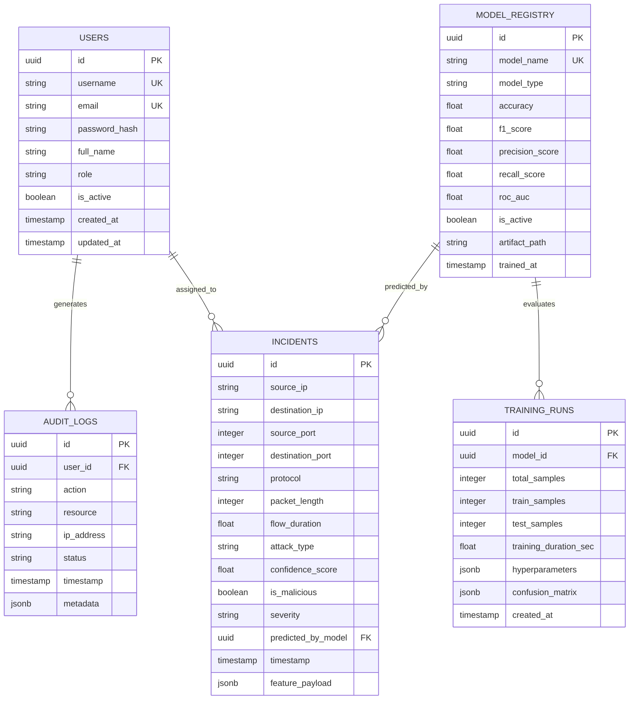

# SentinelAI Database Design Specification

## Overview
SentinelAI uses a fully normalized PostgreSQL relational schema designed for high-concurrency packet ingestion, audit logging, model versioning, and user management.

---

## 1. Entity-Relationship (ER) Diagram

---

## 2. Table Specifications & Schema Definitions

### A. `users` Table
Stores system users with Role-Based Access Control (RBAC).

| Column | Type | Constraints | Description |
| :--- | :--- | :--- | :--- |
| `id` | UUID | PRIMARY KEY, DEFAULT `gen_random_uuid()` | Unique User ID |
| `username` | VARCHAR(50) | UNIQUE, NOT NULL | User login handle |
| `email` | VARCHAR(255) | UNIQUE, NOT NULL | User email address |
| `password_hash` | VARCHAR(255) | NOT NULL | Bcrypt / Argon2 hashed password |
| `full_name` | VARCHAR(100) | NOT NULL | Display name |
| `role` | VARCHAR(20) | NOT NULL, DEFAULT `'analyst'` | Role (`admin`, `analyst`, `viewer`) |
| `is_active` | BOOLEAN | NOT NULL, DEFAULT `true` | Account status flag |
| `created_at` | TIMESTAMP WITH TIME ZONE | DEFAULT `NOW()` | Registration timestamp |

### B. `incidents` Table
Stores predicted network packet inspection results.

| Column | Type | Constraints | Description |
| :--- | :--- | :--- | :--- |
| `id` | UUID | PRIMARY KEY, DEFAULT `gen_random_uuid()` | Incident ID |
| `source_ip` | VARCHAR(45) | NOT NULL, INDEXED | IPv4 / IPv6 source address |
| `destination_ip` | VARCHAR(45) | NOT NULL, INDEXED | IPv4 / IPv6 destination address |
| `source_port` | INTEGER | NOT NULL | Source port number |
| `destination_port` | INTEGER | NOT NULL | Destination port number |
| `protocol` | VARCHAR(10) | NOT NULL | TCP, UDP, ICMP |
| `packet_length` | INTEGER | NOT NULL | Packet size in bytes |
| `flow_duration` | DOUBLE PRECISION | NOT NULL | Flow duration in microseconds |
| `attack_type` | VARCHAR(50) | NOT NULL, INDEXED | Multi-class label (e.g., DDoS, BENIGN) |
| `confidence_score` | DOUBLE PRECISION | NOT NULL | Prediction confidence [0.0 - 1.0] |
| `is_malicious` | BOOLEAN | NOT NULL, INDEXED | High-level binary threat flag |
| `severity` | VARCHAR(15) | NOT NULL | Low, Medium, High, Critical |
| `predicted_by_model` | UUID | REFERENCES `model_registry(id)` | Model used for prediction |
| `timestamp` | TIMESTAMP WITH TIME ZONE | NOT NULL, INDEXED | Packet capture timestamp |
| `feature_payload` | JSONB | NULLABLE | 78+ CICIDS2017 feature vector |

---

## 3. Indexing Strategy & Performance Optimization
- `idx_incidents_timestamp_attack`: Composite index on `(timestamp DESC, attack_type)` for ultra-fast time-series chart querying.
- `idx_incidents_ip_malicious`: Index on `(source_ip, is_malicious)` for rapid threat intelligence lookup.
- Redis Caching Strategy: Active model metadata, live dashboard counters, and revoked JWT tokens are cached in Redis with strict TTLs.
