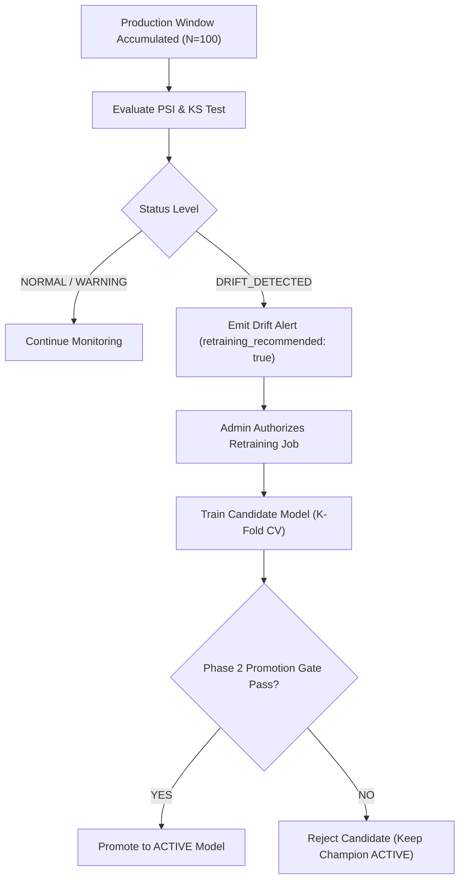

# PRODUCTION DRIFT MONITORING ARCHITECTURE & SPECIFICATION

**System Component**: SentinelAI Drift Monitoring Engine (`ml/monitoring/drift_detector.py`)  
**Specification Version**: 1.0  

---

## 1. Overview & Principles

Production network traffic patterns change over time due to new protocol adoption, server configuration updates, zero-day threat variants, and seasonal load fluctuations. 

SentinelAI monitors production feature distributions ($P(X)$), prediction class shifts ($P(\hat{Y})$), and ground-truth accuracy ($P(Y|X)$).

### Key Rules:
- **Accumulated Windows**: Drift is NEVER evaluated on a single packet or flow. Observations accumulate in sliding windows (configurable size, default $N \ge 50$ or $100$).
- **No Unsafe Automatic Promotion**: Drift alerts emit warnings and trigger retraining recommendations, but **NEVER automatically promote candidate models to ACTIVE**. Candidates must pass K-Fold Cross-Validation, FPR bounds, Recall bounds, and performance gates before promotion.

---

## 2. Statistical Drift Detection Methodology

### A. Population Stability Index (PSI)
Used to measure population distribution shift for continuous and discrete features using a 10-bin quantile/histogram strategy.

$$\text{PSI} = \sum_{i=1}^{B} (P_i - Q_i) \times \ln\left(\frac{P_i}{Q_i}\right)$$

Where $P_i$ is observed production window fraction and $Q_i$ is baseline reference training fraction in bin $i$.

#### PSI Threshold Matrix:
- $\text{PSI} < 0.10$: **NORMAL** (Insignificant distribution shift)
- $0.10 \le \text{PSI} < 0.25$: **WARNING** (Moderate distribution shift)
- $\text{PSI} \ge 0.25$: **DRIFT_DETECTED** (Significant population shift)

---

### B. Kolmogorov-Smirnov (KS) Test
Performs a two-sample Kolmogorov-Smirnov test (`scipy.stats.ks_2samp`) on continuous flow features comparing reference training distribution $F_0(x)$ and production window distribution $F_{\text{prod}}(x)$.

- **Null Hypothesis ($H_0$)**: Reference and production samples are drawn from the same continuous distribution.
- **Bonferroni Alpha Correction**: $\alpha_{\text{eff}} = \frac{\alpha}{M}$ where $M$ is feature count and $\alpha = 0.05$.
- **Drift Condition**: $p\text{-value} < \alpha_{\text{eff}}$ AND $\text{PSI} > 0.10$.

---

## 3. Drift Status Levels

| Status Level | Criteria | Recommended Action |
| :--- | :--- | :--- |
| `NORMAL` | $\text{PSI} < 0.10$ and KS $p\text{-value} \ge 0.05$ | Routine monitoring |
| `WARNING` | $0.10 \le \text{PSI} < 0.25$ or prediction class shift $> 20\%$ | Log alert, monitor window trend |
| `DRIFT_DETECTED` | $\text{PSI} \ge 0.25$ or significant feature decay | Flag retraining recommendation for admin review |

---

## 4. Retraining & Promotion Workflow

