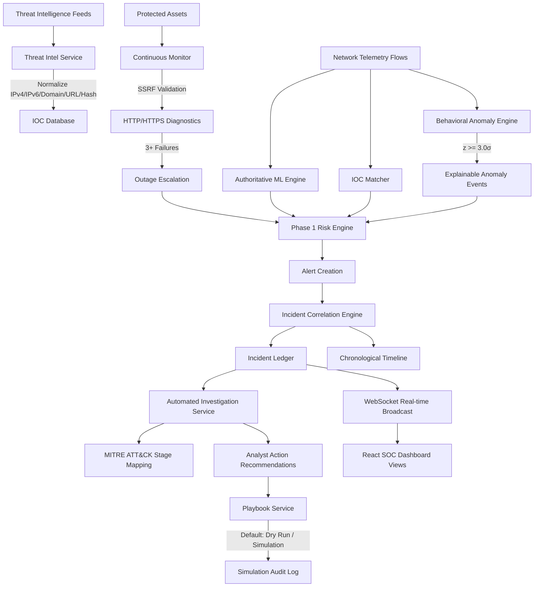

# SentinelAI Phase 2 Architecture Specification

## Overview

SentinelAI Phase 2 builds upon the frozen Phase 1 SOC baseline, introducing an intelligent, production-ready, additive security operations layer. It enhances SentinelAI with continuous asset health monitoring, pluggable threat intelligence enrichment, explainable behavioral anomaly detection, automated incident investigations, MITRE ATT&CK chain mappings, and safe simulation-first playbook automation.

## Unified Operational Pipeline

1. **Protected Assets**: Configured websites, APIs, databases, servers, endpoints, and subnets.
2. **Continuous Monitoring & SSRF Protection**: Background health checks validate targets against RFC 1918 subnets, loopbacks, and cloud metadata before issuing requests.
3. **Threat Intelligence**: Normalizes and indexes indicators of compromise, enriching incoming telemetry non-destructively.
4. **Behavioral Baselines & Anomaly Detection**: Calculates rolling means and standard deviations per asset. Detects deviations ($|z| \ge 3.0$) with human-readable deterministic explanations.
5. **Unified Multi-Signal Risk Engine**: Consolidates ML attack predictions, IOC matches, behavioral anomalies, and health outage signals into the authoritative risk score calculation ($0 - 100$).
6. **Incident Correlation & Timeline**: Groups correlated alerts by target asset and temporal proximity, appending immutable chronological timeline events.
7. **Automated Investigations**: Gathers correlated alerts, flow events, IOC matches, and anomalies, mapping incidents to MITRE ATT&CK framework stages (`RECONNAISSANCE` to `IMPACT`).
8. **Safe Playbook Automation**: Defaults strictly to `is_dry_run = True` simulation mode, appending all simulated and live remediation actions to the incident timeline and audit ledger.
9. **SOC Dashboard Views**: Modern React frontend views for `/monitoring`, `/threat-intel`, `/analytics`, `/investigations`, and `/dashboard`.

## Backward Compatibility & Phase 1 Preservation

- **CatBoost Champion Model**: Retained with exact SHA-256 hash `efb4067565f1837c3dc7ccced66c5debace56dd563b43f64c173ab68b7392e82`.
- **Pretrained Preprocessor**: Retained with exact SHA-256 hash `e5c07b23b9a82ca255c25ce426b3ca660d1338575001ff800bdf1fb1f2c96c46`.
- **Feature Schema**: Strictly preserves the 30 authoritative features in identical schema order.
- **Phase 1 API Endpoints**: All existing `/predict`, `/analytics/summary`, `/reports`, `/logs`, `/train`, `/incidents`, `/assets`, `/alerts`, and `/health` contracts remain unchanged and fully functional.
