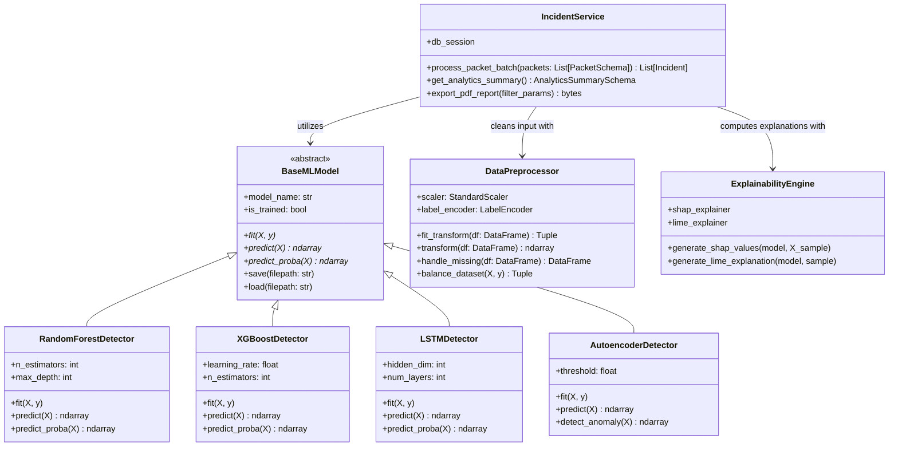
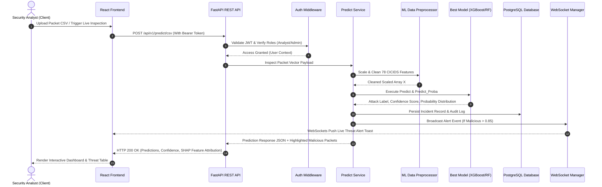
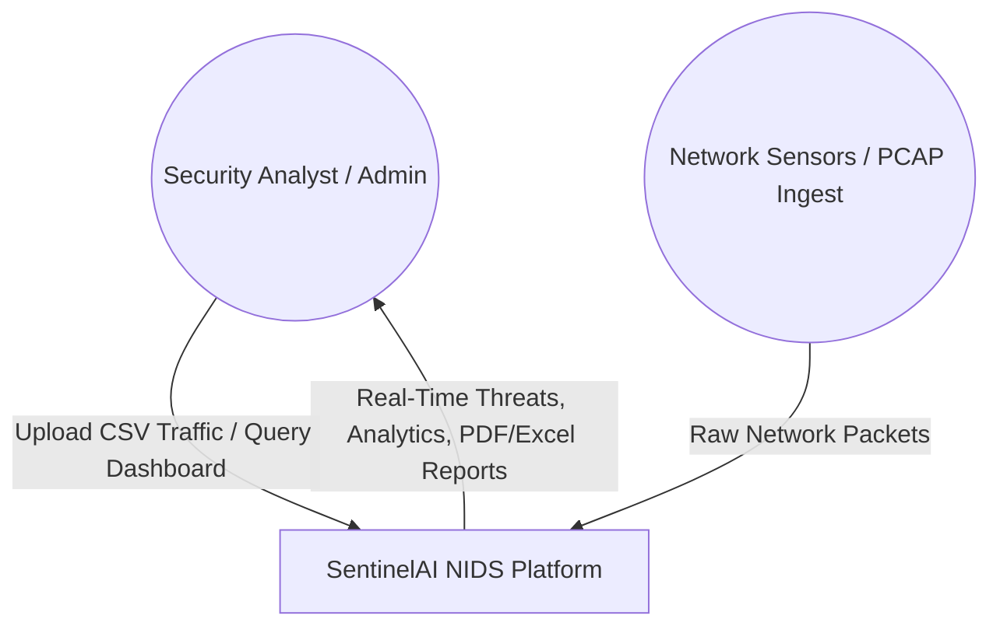
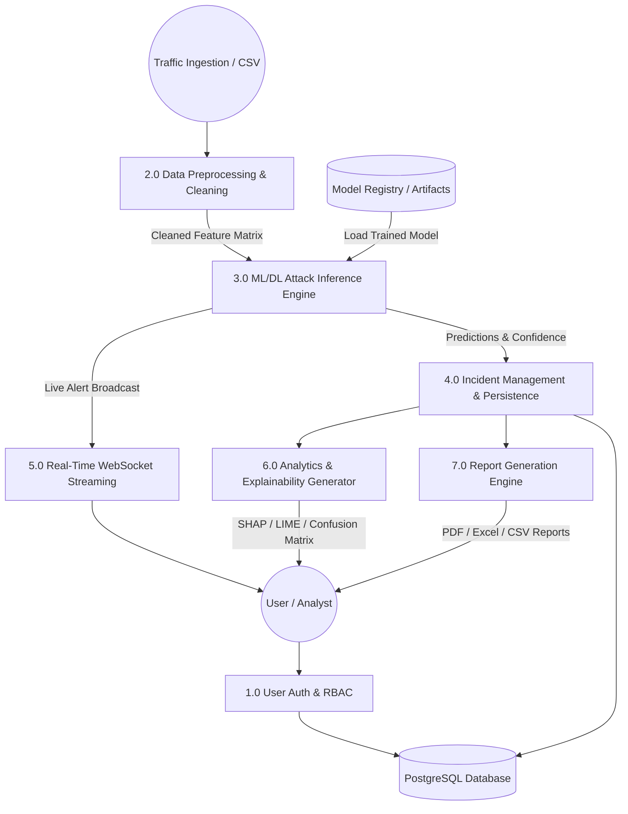
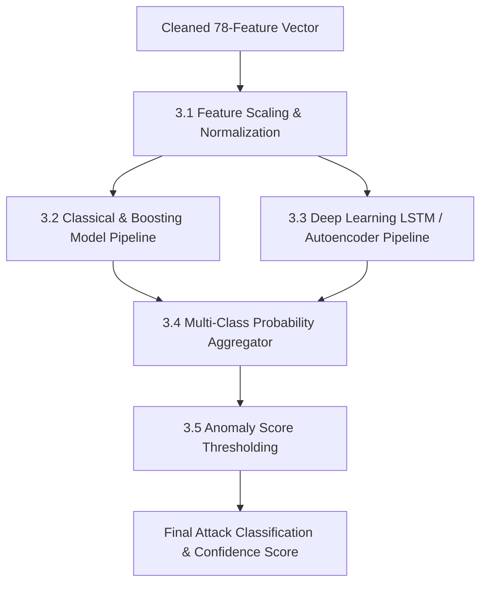

# SentinelAI Comprehensive UML & Data Flow Specifications

This document defines the Object-Oriented Class Hierarchy, Inter-Component Sequence Diagrams, and Multi-Level Data Flow Diagrams (DFDs) for SentinelAI.

---

## 1. Object-Oriented Class Diagram

---

## 2. Real-Time Packet Prediction Sequence Diagram

---

## 3. Data Flow Diagrams (DFD)

### Level 0 DFD (Context Diagram)

### Level 1 DFD (Decomposed System Processes)

### Level 2 DFD (Process 3.0: ML Inference Sub-processes)

